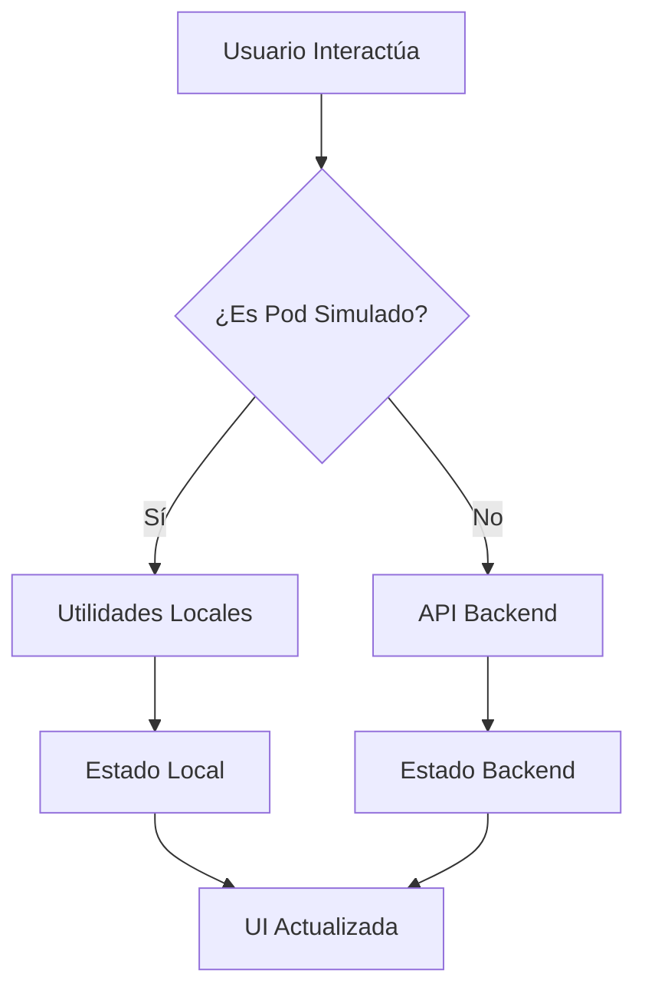
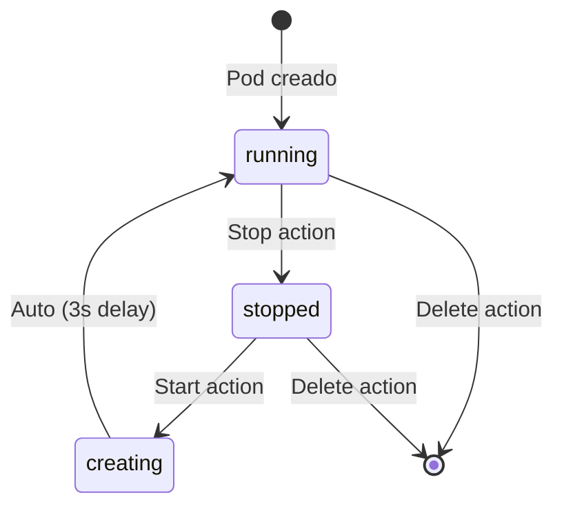

# 🎭 Documentación: Modo de Simulación de Pods - Frontend NeuroPod

## 📖 Introducción

El **Modo de Simulación de Pods** es una funcionalidad implementada en el frontend de NeuroPod que permite demostrar y probar todas las características de gestión de pods sin requerir un backend real o conexión a Kubernetes. Este modo es especialmente útil para:

- 🚀 **Desarrollo del frontend** sin dependencias del backend
- 🎯 **Demostraciones** de funcionalidad a stakeholders
- 🧪 **Testing** de componentes UI de forma aislada
- 📚 **Documentación** interactiva de características

## 🔧 Arquitectura del Sistema de Simulación

### **Componentes Principales**

```
src/
├── types/pod.ts
│   ├── SimulatedPod (extends Pod)
│   └── createSimulatedPod()
├── utils/podUtils.ts
│   ├── getSimulatedPod()
│   ├── toggleSimulatedPodStatus()
│   ├── deleteSimulatedPod()
│   └── recreateSimulatedPod()
├── services/pod.service.ts
│   └── Detección automática de modo simulación
└── components/.../PodConnectDialog.tsx
    └── Renderizado específico para pods simulados
```

### **Flujo de Datos**



## 🎯 Funcionalidades Simuladas

### **1. Gestión de Estado del Pod**

| Función | Comportamiento Simulado | Tiempo de Respuesta |
|---------|------------------------|-------------------|
| **Start** | Cambia estado a `creating` → `running` | Instantáneo + 3s delay |
| **Stop** | Cambia estado a `stopped` | Instantáneo |
| **Delete** | Elimina pod del estado local | Instantáneo |
| **Stats** | Valores aleatorios realistas | Instantáneo |

### **2. Servicios y Conexiones**

```typescript
// Servicios HTTP simulados
httpServices: [
  {
    port: 8888,
    serviceName: 'Jupyter Lab',
    url: 'https://simulated-pod-1-8888.neuropod.online',
    status: 'ready'
  },
  {
    port: 7860,
    serviceName: 'ComfyUI',
    url: 'https://simulated-pod-1-7860.neuropod.online',
    status: 'ready'
  }
]

// Servicios TCP simulados
tcpServices: [
  {
    port: 22,
    serviceName: 'SSH',
    url: 'tcp://simulated-pod-1-22.neuropod.online:22',
    status: 'disable'
  }
]
```

### **3. Logs Dinámicos**

```bash
[HH:MM:SS] Pod simulado iniciado correctamente
[HH:MM:SS] Iniciando servicios ComfyUI y Jupyter Lab...
[HH:MM:SS] Servicios principales inicializados
[HH:MM:SS] Montando volumen de usuario en /workspace
[HH:MM:SS] Configurando red y puertos (8888, 7860)
[HH:MM:SS] Inicializando entorno de usuario
[HH:MM:SS] ComfyUI disponible en puerto 7860
[HH:MM:SS] Jupyter Lab disponible en puerto 8888
[HH:MM:SS] ¡Pod listo para ser utilizado!
[HH:MM:SS] Esperando conexiones en subdominios...
[HH:MM:SS] 🎃 Este es un pod de demostración para mostrar funcionalidades
```

## 💻 Implementación Técnica

### **Detección de Pods Simulados**

```typescript
// Verificación del tipo de pod
const isSimulated = (pod as SimulatedPod).isSimulated === true;

if (isSimulated) {
  // Usar utilidades locales
  const updatedPod = toggleSimulatedPodStatus(user);
} else {
  // Usar API backend
  const updatedPod = await podService.startPod(podId);
}
```

### **Estado Centralizado**

```typescript
// Estado global del pod simulado
let simulatedPodState: SimulatedPod | null = null;

// Función para obtener/crear pod simulado
export const getSimulatedPod = (user?: { email: string; role: string }): SimulatedPod | null => {
  if (!simulatedPodState) {
    simulatedPodState = createSimulatedPod(user);
  }
  return simulatedPodState;
};
```

### **Operaciones sin API**

```typescript
// Ejemplo: Toggle del estado del pod
export const toggleSimulatedPodStatus = (user?: { email: string; role: string }): SimulatedPod => {
  const pod = getSimulatedPod(user);
  
  if (pod.status === "running") {
    pod.status = "stopped";
    pod.stats.cpuUsage = 0;
    // ... más cambios de estado
    toast.success(`Pod ${pod.podName} detenido correctamente`);
  }
  
  return pod;
};
```

## 🎨 Experiencia de Usuario

### **Indicadores Visuales**

#### **1. Cards de Servicios**
- 🟠 **Bordes naranjas** en lugar de grises
- 🏷️ **Etiqueta "Simulado"** en cada servicio
- 📱 **URLs visibles** para mostrar el endpoint que se abriría

#### **2. Botones Interactivos**
- 🔄 **"Demo"** en lugar de "Abrir"
- 💬 **Alerts explicativos** al hacer clic
- ⚡ **Respuesta instantánea** sin cargas

#### **3. Modal de Conexión**
```jsx
{/* Banner de simulación */}
<div className="bg-orange-100 border border-orange-200 rounded-lg p-3">
  <div className="flex items-center gap-2">
    <span className="text-orange-600 text-lg">🎭</span>
    <span className="text-orange-800 font-medium">Modo Simulación</span>
  </div>
  <p className="text-sm text-orange-700 mt-1">
    Este es un pod de demostración. Las conexiones son simuladas para mostrar la funcionalidad.
  </p>
</div>
```

### **Mensajes de Interacción**

```javascript
// Al hacer clic en botón "Demo"
alert(`🚀 Simulación: Se abriría ${url}

En un entorno real, esto abriría el servicio en una nueva pestaña.`);
```

## 🔄 Estados del Pod Simulado

### **Diagrama de Estados**



### **Transiciones de Estado**

| Estado Actual | Acción | Estado Final | Duración |
|---------------|--------|--------------|----------|
| `running` | Stop | `stopped` | Instantáneo |
| `stopped` | Start | `creating` | Instantáneo |
| `creating` | Auto | `running` | 3 segundos |
| Cualquiera | Delete | Eliminado | Instantáneo |

## 🚀 Uso en Desarrollo

### **Activación Automática**

El modo de simulación se activa automáticamente cuando:

```typescript
// Condiciones para activar simulación
if (import.meta.env.DEV && 
   (error.isConnectionError || !error.response || error.code === 'ECONNABORTED')) {
  console.warn('Usando pod simulado (el backend no está disponible)');
  return getSimulatedPods(user);
}
```

### **Configuración de Desarrollo**

```bash
# Variables de entorno para desarrollo
VITE_API_URL=http://localhost:3000

# Si el backend no está disponible en localhost:3000,
# automáticamente se activa el modo de simulación
```

## 🔍 Diferencias vs Pods Reales

### **Pods Simulados**

| Característica | Comportamiento |
|----------------|---------------|
| **API Calls** | ❌ No se realizan |
| **WebSockets** | ❌ No se conectan |
| **Estado** | 🔄 Local, en memoria |
| **Persistencia** | ⏳ Solo durante la sesión |
| **URLs** | 🎭 Simuladas con alertas |
| **Logs** | 📝 Contenido predefinido |
| **Tiempo de respuesta** | ⚡ Instantáneo |

### **Pods Reales**

| Característica | Comportamiento |
|----------------|---------------|
| **API Calls** | ✅ Llamadas al backend |
| **WebSockets** | ✅ Conexión en tiempo real |
| **Estado** | 🌐 Sincronizado con servidor |
| **Persistencia** | 💾 Base de datos |
| **URLs** | 🔗 Enlaces reales funcionales |
| **Logs** | 📊 Datos reales del contenedor |
| **Tiempo de respuesta** | 🕐 Según red y servidor |

## 🛠️ Mantenimiento y Extensión

### **Agregar Nuevas Funcionalidades**

1. **Actualizar tipos**:
```typescript
// En src/types/pod.ts
export interface SimulatedPod extends Pod {
  isSimulated: true;
  newFeature?: string; // Nueva característica
}
```

2. **Implementar lógica**:
```typescript
// En src/utils/podUtils.ts
export const newSimulatedFeature = (): SimulatedPod => {
  const pod = getSimulatedPod();
  // Lógica de la nueva funcionalidad
  return pod;
};
```

3. **Integrar en componentes**:
```typescript
// En componentes
if (isSimulated) {
  newSimulatedFeature();
} else {
  await apiService.newFeature();
}
```

### **Testing**

```bash
# Comandos para probar modo simulación
npm run dev

# 1. Abrir http://localhost:5173
# 2. Hacer login (cualquier email)
# 3. Ir a /admin/pods o /client/pods
# 4. Verificar que aparece el pod "ComfyUI-Demo"
# 5. Probar todas las acciones (start, stop, delete, connect, logs)
```

## 📊 Métricas de Simulación

### **Performance**

- ⚡ **Tiempo de respuesta**: < 50ms para todas las operaciones
- 💾 **Uso de memoria**: < 1MB para estado del pod
- 🔄 **Actualizaciones UI**: Inmediatas sin re-renders innecesarios

### **Cobertura Funcional**

- ✅ **100%** de funcionalidades básicas (CRUD)
- ✅ **100%** de estados de pod
- ✅ **100%** de servicios y conexiones
- ✅ **100%** de logs y debugging

## 🔮 Roadmap Futuro

### **Versión 2.0 del Modo Simulación**

- [ ] **Múltiples pods simulados** por usuario
- [ ] **Persistencia en localStorage** entre sesiones
- [ ] **Simulación de errores** y estados de fallo
- [ ] **Métricas temporales** que cambien en tiempo real
- [ ] **Templates simulados** para diferentes tipos de pods
- [ ] **Simulación de WebSockets** con eventos sintéticos

### **Integración con Backend Real**

- [ ] **Detección automática** de disponibilidad del backend
- [ ] **Fallback inteligente** a simulación si falla el backend
- [ ] **Modo híbrido** con algunos datos reales y otros simulados
- [ ] **Sincronización** de pods simulados con backend cuando esté disponible

---

## 📞 Soporte

Para preguntas sobre el modo de simulación:

- **Documentación técnica**: Este archivo
- **Código fuente**: `src/utils/podUtils.ts`, `src/types/pod.ts`
- **Ejemplos de uso**: Componentes en `src/components/*/pods/`
- **Issues**: Reportar en el repositorio del proyecto

---

**El modo de simulación de NeuroPod proporciona una experiencia completa de desarrollo y demostración sin requerir infraestructura backend, permitiendo un desarrollo ágil y demostraciones efectivas de la funcionalidad del sistema.**
