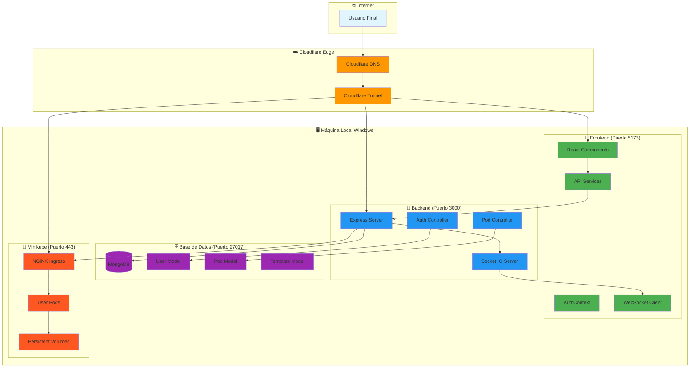
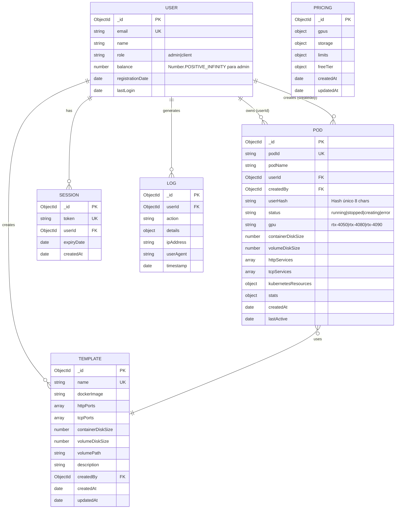
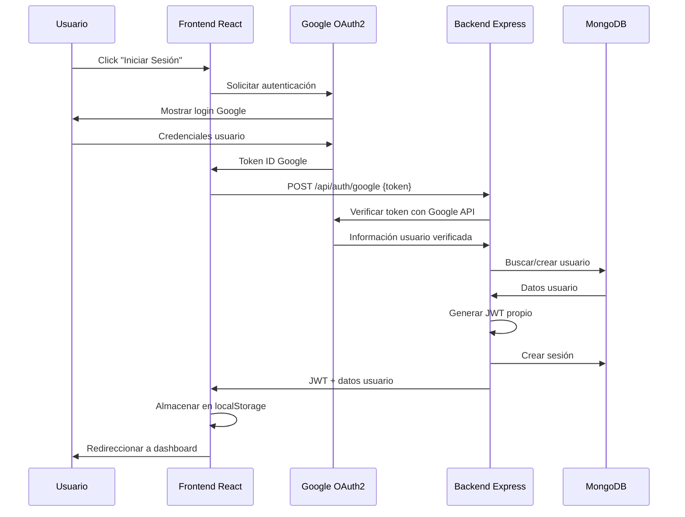

# 4. Planteamiento / Arquitectura del Proyecto NeuroPod

## 4.1 Stack Tecnológico Implementado

### **Frontend: Aplicación React Moderna**

**Tecnologías Core:**
- **React 18.3.1** con **TypeScript 5.5.3** para tipado estático
- **Vite 5.4.1** como bundler moderno con plugin React SWC para compilación rápida
- **TailwindCSS 3.4.11** para estilización utilitaria y responsiva
- **shadcn-ui** como sistema de componentes basado en Radix UI primitives

**Dependencias de Funcionalidad:**
- **@react-oauth/google 0.12.2** para autenticación OAuth2 con Google
- **axios 1.9.0** para comunicación HTTP con el backend
- **socket.io-client 4.8.1** para comunicación en tiempo real
- **react-router-dom 6.26.2** para navegación SPA (Single Page Application)
- **@tanstack/react-query 5.56.2** para gestión de estado del servidor

**Arquitectura de Componentes:**
- **40+ componentes** organizados jerárquicamente por roles (admin/, client/)
- **Context API** (AuthContext) para gestión de estado global de autenticación
- **Custom Hooks** para WebSockets, notificaciones globales y actualizaciones de pods
- **Services Layer** para abstracción de APIs (api.ts, pod.service.ts, pricing.service.ts)

### **Backend: API REST con Node.js**

**Tecnologías Core:**
- **Node.js 22** con **Express 4.18.2** para servidor HTTP
- **MongoDB** con **Mongoose 8.0.3** como ODM (Object Document Mapper)
- **Socket.IO 4.8.1** para comunicación bidireccional en tiempo real
- **@kubernetes/client-node 1.2.0** para integración con Kubernetes API

**Dependencias de Seguridad:**
- **jsonwebtoken 9.0.2** para autenticación JWT
- **google-auth-library 9.15.1** para verificación de tokens OAuth2
- **cors 2.8.5** para configuración de CORS
- **dotenv 16.3.1** para gestión de variables de entorno

**Arquitectura de Servicios:**
- **5 controladores** especializados (auth, pod, pricing, status, template)
- **6 modelos MongoDB** con esquemas Mongoose validados
- **Middleware de autenticación** con protección basada en roles
- **Servicios de Kubernetes** para gestión del ciclo de vida de pods

### **Infraestructura: Kubernetes Local + Cloudflare**

**Orquestación de Contenedores:**
- **Minikube** como clúster Kubernetes local con driver Docker
- **NGINX Ingress Controller** para enrutamiento de tráfico HTTP/HTTPS
- **Docker Desktop** con integración WSL2 y soporte GPU
- **Persistent Volumes** con StorageClass hostPath para persistencia de datos

**Exposición Externa:**
- **Cloudflare Tunnel** para conectividad segura sin IP pública
- **Subdominios dinámicos** (`*.neuropod.online`) para cada pod de usuario
- **Certificados TLS autofirmados** con secret de Kubernetes
- **DNS wildcard** con configuración Cloudflare

## 4.2 Arquitectura de Sistema Completa



**Flujo de Datos Principal:**
1. **Usuario** → Cloudflare DNS → Tunnel → NGINX Ingress → Pod de Usuario
2. **Frontend React** → Axios → Express API → MongoDB → Respuesta
3. **Socket.IO** → WebSocket bidireccional → Actualizaciones en tiempo real
4. **Kubernetes API** → Creación/gestión de pods → Persistent Volumes

## 4.3 Arquitectura de Red Implementada

### **Configuración de Dominios y Subdominios**

**Estructura de URLs:**
```
https://app.neuropod.online          → Frontend React (puerto 5173)
https://api.neuropod.online          → Backend Express (puerto 3000)
https://*.neuropod.online            → Pods dinámicos (puerto 443)
https://pod-usr123-8888.neuropod.online → Ejemplo de pod específico
```

**Cloudflare Tunnel Configuration:**
```yaml
tunnel: neuropod-tunnel
credentials-file: ~/.cloudflared/neuropod-tunnel.json

ingress:
  # Frontend React
  - hostname: app.neuropod.online
    service: http://localhost:5173
  
  # Backend API con WebSocket
  - hostname: api.neuropod.online
    service: http://localhost:3000
    originRequest:
      noTLSVerify: true
      upgradeRequest: true  # Soporte WebSocket
  
  # Wildcard para pods dinámicos
  - hostname: "*.neuropod.online"
    service: https://localhost:443
    originRequest:
      noTLSVerify: true
  
  # Fallback
  - service: http_status:404
```

**NGINX Ingress Controller:**
```yaml
# Configuración optimizada para Cloudflare Tunnel
data:
  ssl-redirect: "false"
  force-ssl-redirect: "false"
  use-forwarded-headers: "true"
  compute-full-forwarded-for: "true"
  server-name-hash-bucket-size: "256"
  proxy-read-timeout: "3600"
  proxy-send-timeout: "3600"
  proxy-http-version: "1.1"
```

## 4.4 Arquitectura de Base de Datos MongoDB

### **Modelo de Datos Implementado**



**Relaciones y Validaciones:**
- **Usuario-Pod**: Relación 1:N con diferenciación entre propietario (userId) y creador (createdBy)
- **Template-Pod**: Referencia para configuración predefinida
- **Validaciones Mongoose**: Campos requeridos, únicos, y rangos numéricos
- **Middleware pre-save**: Hash de contraseñas, actualización de timestamps

## 4.5 Arquitectura de Seguridad Aplicada

### **Autenticación Multi-Capa**

**Flujo OAuth2 + JWT:**


**Control de Acceso Basado en Roles:**
```javascript
// Middleware de autenticación implementado
const protect = async (req, res, next) => {
  const token = req.headers.authorization?.split(' ')[1];
  const decoded = jwt.verify(token, process.env.JWT_SECRET);
  req.user = await User.findById(decoded.id);
  next();
};

const authorize = (...roles) => (req, res, next) => {
  if (!roles.includes(req.user.role)) {
    return res.status(403).json({ message: 'Acceso denegado' });
  }
  next();
};
```

**Configuración de Variables de Entorno:**
```env
# Autenticación JWT
JWT_SECRET=clave_secreta_segura
JWT_EXPIRE=24h

# Google OAuth2
GOOGLE_CLIENT_ID=example_client_id
GOOGLE_CLIENT_SECRET=example_client_secret

# Control de acceso
TRUST_GOOGLE_AUTH=true
ADMIN_EMAILS=lolerodiez@gmail.com
```

## 4.6 Arquitectura de Comunicación en Tiempo Real

### **WebSocket con Socket.IO**

**Servidor (Backend):**
```javascript
// socket.js - Configuración Socket.IO
const io = require('socket.io')(server, {
  cors: {
    origin: [
      "http://localhost:5173",
      "https://app.neuropod.online"
    ],
    credentials: true
  }
});

// Eventos implementados
io.on('connection', (socket) => {
  // Suscripción a pods
  socket.on('subscribe', (podId) => {
    socket.join(`pod-${podId}`);
  });
  
  // Actualizaciones de pods
  socket.on('podUpdate', (data) => {
    io.to(`pod-${data.podId}`).emit('podUpdate', data);
  });
  
  // Logs en tiempo real
  socket.on('requestLogs', (podId) => {
    // Obtener logs de Kubernetes
    const logs = k8sApi.getNamespacedPodLog(podId);
    socket.emit('podLogs', { podId, logs });
  });
});
```

**Cliente (Frontend):**
```typescript
// websocket.service.ts - Cliente Socket.IO
class WebSocketService {
  private socket: Socket | null = null;
  
  connect(token: string) {
    this.socket = io(API_URL, {
      auth: { token },
      transports: ['websocket', 'polling']
    });
    
    this.socket.on('podUpdate', (data) => {
      // Actualizar estado local
      updatePodInCache(data);
    });
  }
  
  subscribeToPod(podId: string) {
    this.socket?.emit('subscribe', podId);
  }
}
```

## 4.7 Arquitectura de Infraestructura Kubernetes

### **Manifiestos Implementados**

**Recursos Kubernetes Aplicados:**
```yaml
# neuropod-k8s.yaml - Configuración completa
apiVersion: v1
kind: ConfigMap
metadata:
  name: neuropod-config
data:
  domain: "neuropod.online"
  maxPodsPerUser: "5"
  workspacePath: "/workspace"

---
apiVersion: networking.k8s.io/v1
kind: IngressClass
metadata:
  name: neuropod-nginx
spec:
  controller: k8s.io/ingress-nginx

---
apiVersion: storage.k8s.io/v1
kind: StorageClass
metadata:
  name: standard
provisioner: k8s.io/minikube-hostpath
reclaimPolicy: Retain
volumeBindingMode: Immediate

---
apiVersion: v1
kind: PersistentVolume
metadata:
  name: neuropod-pv-global
spec:
  capacity:
    storage: 500Gi
  accessModes:
    - ReadWriteMany
  hostPath:
    path: /mnt/data/workspace
```

**Gestión Dinámica de Pods:**
```javascript
// kubernetes.service.js - Gestión de ciclo de vida
const createPod = async (podConfig) => {
  const podManifest = {
    apiVersion: 'v1',
    kind: 'Pod',
    metadata: {
      name: `${podConfig.podName}-${podConfig.userHash}`,
      labels: {
        'app': 'neuropod-user-pod',
        'neuropod-user': podConfig.userHash
      }
    },
    spec: {
      containers: [{
        name: 'user-container',
        image: podConfig.dockerImage,
        resources: {
          limits: {
            'nvidia.com/gpu': '1',
            memory: process.env.POD_MEMORY_LIMIT,
            cpu: process.env.POD_CPU_LIMIT
          }
        },
        volumeMounts: [{
          name: 'workspace',
          mountPath: '/workspace'
        }]
      }],
      volumes: [{
        name: 'workspace',
        persistentVolumeClaim: {
          claimName: `workspace-${podConfig.userHash}`
        }
      }]
    }
  };
  
  return await k8sApi.createNamespacedPod('default', podManifest);
};
```

## 4.8 Arquitectura de Automatización

### **Scripts PowerShell Implementados**

**Arrancar.ps1 - Inicio Automatizado:**
```powershell
# Verificación de permisos administrador
if (-not ([Security.Principal.WindowsPrincipal] [Security.Principal.WindowsIdentity]::GetCurrent()).IsInRole([Security.Principal.WindowsBuiltInRole] "Administrator")) {
    Write-Host "Ejecutar como ADMINISTRADOR" -ForegroundColor Red
    exit
}

# Secuencia de inicio orquestada
Start-Process "C:\Program Files\Docker\Docker\Docker Desktop.exe"
wt -w 0 nt --title "Cloudflare Tunnel" powershell -NoExit -Command "cloudflared.exe tunnel run neuropod-tunnel"
wt -w 0 nt --title "Minikube" powershell -NoExit -Command "minikube start --driver=docker --gpus=all --memory=12000mb --cpus=8"
wt -w 0 nt --title "MongoDB" powershell -NoExit -Command "& 'C:\Program Files\MongoDB\Server\8.0\bin\mongod.exe' --dbpath='C:\data\db'"
wt -w 0 nt --title "Minikube Tunnel" powershell -NoExit -Command "minikube tunnel"

# Inicio de aplicaciones Node.js
wt -w 0 nt --title "NeuroPod Backend" cmd /k "cd /d $BackendPath && npm start"
wt -w 0 nt --title "NeuroPod Frontend" cmd /k "cd /d $FrontendPath && npm run dev"
```

**Detener.ps1 - Cierre Coordinado:**
```powershell
# Función para detener procesos específicos
function Stop-ProcessSafely {
    param([string]$ProcessName, [string]$DisplayName)
    
    try {
        $processes = Get-Process -Name $ProcessName -ErrorAction SilentlyContinue
        if ($processes) {
            $processes | Stop-Process -Force
            Write-Host "✅ $DisplayName detenido correctamente." -ForegroundColor Green
        }
    } catch {
        Write-Host "⚠️ $DisplayName no estaba en ejecución." -ForegroundColor Gray
    }
}

# Secuencia de cierre
Stop-ProcessSafely -ProcessName "node" -DisplayName "Backend/Frontend"
Stop-ProcessSafely -ProcessName "minikube" -DisplayName "Minikube Tunnel"
& minikube stop
Stop-ProcessSafely -ProcessName "cloudflared" -DisplayName "Cloudflare Tunnel"
Stop-ProcessSafely -ProcessName "mongod" -DisplayName "MongoDB"
& wsl --shutdown
```

## 4.9 Patrones de Diseño Aplicados

### **Frontend - React Patterns**

**Context Provider Pattern:**
```typescript
// AuthContext.tsx - Estado global de autenticación
const AuthContext = createContext<AuthContextType | undefined>(undefined);

export const AuthProvider: React.FC<{ children: React.ReactNode }> = ({ children }) => {
  const [user, setUser] = useState<User | null>(null);
  const [isLoading, setIsLoading] = useState(true);
  
  // Verificación automática de sesión
  useEffect(() => {
    const token = localStorage.getItem('token');
    if (token) {
      authService.verify()
        .then(setUser)
        .catch(() => logout());
    }
    setIsLoading(false);
  }, []);
  
  return (
    <AuthContext.Provider value={{ user, login, logout, isLoading }}>
      {children}
    </AuthContext.Provider>
  );
};
```

**Custom Hooks Pattern:**
```typescript
// usePodUpdates.ts - Hook especializado
export const usePodUpdates = (podId?: string) => {
  const [pods, setPods] = useState<Pod[]>([]);
  const { socket } = useWebSocket();
  
  useEffect(() => {
    if (podId && socket) {
      socket.emit('subscribe', podId);
      
      const handlePodUpdate = (updatedPod: Pod) => {
        setPods(prev => prev.map(pod => 
          pod.podId === updatedPod.podId ? updatedPod : pod
        ));
      };
      
      socket.on('podUpdate', handlePodUpdate);
      return () => socket.off('podUpdate', handlePodUpdate);
    }
  }, [podId, socket]);
  
  return { pods, setPods };
};
```

### **Backend - Node.js Patterns**

**Controller Pattern:**
```javascript
// pod.controller.js - Controlador especializado
class PodController {
  // Obtener pods del usuario
  static async getPods(req, res) {
    try {
      const { userEmail } = req.query;
      
      let query = {};
      if (req.user.role === 'admin' && userEmail) {
        const targetUser = await User.findOne({ email: userEmail });
        query.userId = targetUser._id;
      } else {
        query.userId = req.user._id;
      }
      
      const pods = await Pod.find(query).populate('userId', 'email name');
      res.json({ success: true, data: pods });
    } catch (error) {
      errorResponse(res, error);
    }
  }
  
  // Crear nuevo pod
  static async createPod(req, res) {
    try {
      const podData = { ...req.body };
      
      // Asignación de usuario (admin puede asignar a otros)
      if (req.user.role === 'admin' && podData.assignToUser) {
        const targetUser = await User.findOne({ email: podData.assignToUser });
        podData.userId = targetUser._id;
      } else {
        podData.userId = req.user._id;
      }
      
      podData.createdBy = req.user._id;
      
      const pod = await kubernetesService.createPod(podData);
      res.status(201).json({ success: true, data: pod });
    } catch (error) {
      errorResponse(res, error);
    }
  }
}
```

**Service Layer Pattern:**
```javascript
// kubernetes.service.js - Abstracción de Kubernetes
class KubernetesService {
  static async createPod(podConfig) {
    // 1. Crear PVC para workspace
    const pvc = await this.createPVC(podConfig);
    
    // 2. Crear Pod con configuración
    const pod = await this.createPodManifest(podConfig);
    
    // 3. Crear Services para puertos
    const services = await this.createServices(podConfig);
    
    // 4. Crear Ingress para subdominios
    const ingress = await this.createIngress(podConfig);
    
    // 5. Actualizar base de datos
    return await Pod.create({
      ...podConfig,
      kubernetesResources: { pod, pvc, services, ingress }
    });
  }
}
```

## 4.10 Decisiones Arquitectónicas Clave

### **Justificación de Tecnologías Elegidas**

**React 18 + TypeScript:**
- **Tipado estático** previene errores en tiempo de compilación
- **Hooks modernos** (useContext, useEffect) para gestión de estado
- **Component composition** para reutilización y mantenibilidad
- **Vite** ofrece hot reload rápido y build optimizado

**Express + MongoDB:**
- **Express** proporciona flexibilidad para API REST y WebSockets
- **MongoDB** con esquemas flexibles ideal para datos dinámicos de pods
- **Mongoose** ODM ofrece validaciones y middleware pre/post hooks
- **Arquitectura sin estado** permite escalabilidad horizontal

**Minikube + Docker:**
- **Desarrollo local** sin necesidad de clúster cloud
- **Minikube** simula entorno Kubernetes real
- **Docker Desktop** integración nativa con Windows + WSL2
- **NGINX Ingress** enrutamiento flexible de subdominios

**Cloudflare Tunnel:**
- **Sin IP pública** - seguridad mejorada
- **Conexión outbound** - no requiere configuración de firewall
- **SSL termination** automático en edge de Cloudflare
- **Subdominios dinámicos** para cada pod de usuario

### **Trade-offs y Limitaciones Aceptadas**

**Certificados Autofirmados:**
- **Ventaja**: Desarrollo local simplificado
- **Limitación**: Warnings de navegador, no válido para producción
- **Justificación**: Cloudflare Tunnel maneja SSL real en edge

**MongoDB Local:**
- **Ventaja**: Datos locales, desarrollo offline
- **Limitación**: No replicación, no alta disponibilidad
- **Justificación**: Entorno de desarrollo, fácil migración a MongoDB Atlas

**Minikube Single-Node:**
- **Ventaja**: Recursos mínimos, setup simple
- **Limitación**: No simula cluster multi-nodo real
- **Justificación**: Suficiente para validar conceptos y desarrollo

**Persistent Volumes HostPath:**
- **Ventaja**: Persistencia real en desarrollo
- **Limitación**: No funciona en cluster multi-nodo
- **Justificación**: Minikube single-node, datos persisten entre reinicios

---

**Esta arquitectura implementada en NeuroPod demuestra una integración exitosa de tecnologías modernas para crear una plataforma funcional de gestión de contenedores Docker, con capacidades de tiempo real, autenticación robusta y exposición segura a Internet, todo ejecutándose en un entorno de desarrollo local.**