# 4. Planteamiento / Arquitectura del Proyecto NeuroPod

## 4.1 Stack Tecnológico Implementado

### **Frontend: Aplicación React Moderna**

**Tecnologías Core:**
- **React 18.3.1** con **TypeScript 5.5.3** para tipado estático
- **Vite 5.4.1** como bundler moderno con plugin React SWC para compilación rápida
- **TailwindCSS 3.4.11** para estilización utilitaria y responsiva
- **shadcn-ui** como sistema de componentes basado en Radix UI primitives

**Dependencias de Funcionalidad:**
- **@react-oauth/google 0.12.2** para autenticación OAuth2 con Google
- **axios 1.9.0** para comunicación HTTP con el backend
- **socket.io-client 4.8.1** para comunicación en tiempo real
- **react-router-dom 6.26.2** para navegación SPA (Single Page Application)
- **@tanstack/react-query 5.56.2** para gestión de estado del servidor
- **react-hook-form 7.53.0** para gestión de formularios
- **zod 3.24.4** para validación de esquemas

**Arquitectura de Componentes:**
- **50+ componentes** organizados jerárquicamente por roles (admin/, client/)
- **Context API** (AuthContext) para gestión de estado global de autenticación
- **Custom Hooks** para WebSockets, notificaciones globales y actualizaciones de pods
- **Services Layer** para abstracción de APIs (api.ts, pod.service.ts, pricing.service.ts)

### **Backend: API REST con Node.js**

**Tecnologías Core:**
- **Node.js 22** con **Express 4.18.2** para servidor HTTP
- **MongoDB** con **Mongoose 8.0.3** como ODM (Object Document Mapper)
- **Socket.IO 4.8.1** para comunicación bidireccional en tiempo real
- **@kubernetes/client-node 1.2.0** para integración con Kubernetes API

**Dependencias de Seguridad:**
- **jsonwebtoken 9.0.2** para autenticación JWT
- **google-auth-library 9.15.1** para verificación de tokens OAuth2
- **cors 2.8.5** para configuración de CORS
- **dotenv 16.3.1** para gestión de variables de entorno

**Arquitectura de Servicios:**
- **5 controladores** especializados (auth, pod, pricing, status, template)
- **6 modelos MongoDB** con esquemas Mongoose validados
- **Middleware de autenticación** con protección basada en roles
- **Servicios de Kubernetes** para gestión del ciclo de vida de pods

### **Infraestructura: Kubernetes Local + Cloudflare**

**Orquestación de Contenedores:**
- **Minikube** como clúster Kubernetes local con driver Docker
- **NGINX Ingress Controller** para enrutamiento de tráfico HTTP/HTTPS
- **Docker Desktop** con integración WSL2 y soporte GPU
- **Persistent Volumes** con StorageClass hostPath para persistencia de datos

**Exposición Externa:**
- **Cloudflare Tunnel** para conectividad segura sin IP pública
- **Subdominios dinámicos** (`*.neuropod.online`) para cada pod de usuario
- **Certificados TLS autofirmados** con secret de Kubernetes
- **DNS wildcard** con configuración Cloudflare

## 4.2 Arquitectura de Sistema Completa


**Flujo de Datos Principal:**
1. **Usuario** → Cloudflare DNS → Tunnel → NGINX Ingress → Pod de Usuario
2. **Frontend React** → Axios → Express API → MongoDB → Respuesta
3. **Socket.IO** → WebSocket bidireccional → Actualizaciones en tiempo real
4. **Kubernetes API** → Creación/gestión de pods → Persistent Volumes

## 4.3 Arquitectura de Red Implementada

### **Configuración de Dominios y Subdominios**

**Estructura de URLs:**
```
https://app.neuropod.online          → Frontend React (puerto 5173)
https://api.neuropod.online          → Backend Express (puerto 3000)
https://*.neuropod.online            → Pods dinámicos (puerto 443)
https://pod-usr123-8888.neuropod.online → Ejemplo de pod específico
```

**Cloudflare Tunnel Configuration:**
```yaml
tunnel: neuropod-tunnel
credentials-file: ~/.cloudflared/neuropod-tunnel.json

ingress:
  # Frontend React
  - hostname: app.neuropod.online
    service: http://localhost:5173
  
  # Backend API con WebSocket
  - hostname: api.neuropod.online
    service: http://localhost:3000
    originRequest:
      noTLSVerify: true
      upgradeRequest: true  # Soporte WebSocket
  
  # Wildcard para pods dinámicos
  - hostname: "*.neuropod.online"
    service: https://localhost:443
    originRequest:
      noTLSVerify: true
  
  # Fallback
  - service: http_status:404
```

**NGINX Ingress Controller:**
```yaml
# Configuración optimizada para Cloudflare Tunnel
data:
  ssl-redirect: "false"
  force-ssl-redirect: "false"
  use-forwarded-headers: "true"
  compute-full-forwarded-for: "true"
  server-name-hash-bucket-size: "256"
  proxy-read-timeout: "3600"
  proxy-send-timeout: "3600"
  proxy-http-version: "1.1"
```

## 4.4 Arquitectura de Base de Datos MongoDB

### **Modelo de Datos Implementado**


**Relaciones y Validaciones:**
- **Usuario-Pod**: Relación 1:N con diferenciación entre propietario (userId) y creador (createdBy)
- **Template-Pod**: Referencia para configuración predefinida
- **Validaciones Mongoose**: Campos requeridos, únicos, y rangos numéricos
- **Middleware pre-save**: Hash de contraseñas, actualización de timestamps

## 4.5 Arquitectura de Seguridad Aplicada

### **Autenticación Multi-Capa**

**Flujo OAuth2 + JWT:**

```mermaid
sequenceDiagram
    participant U as Usuario
    participant F as Frontend React
    participant G as Google OAuth2
    participant B as Backend Express
    participant M as MongoDB
    
    U->>F: Click "Iniciar Sesión"
    F->>G: Solicitar autenticación
    G->>U: Mostrar login Google
    U->>G: Credenciales usuario
    G->>F: Token ID Google
    F->>B: POST /api/auth/google {token}
    B->>G: Verificar token con Google API
    G->>B: Información usuario verificada
    B->>M: Buscar/crear usuario
    M->>B: Datos usuario
    B->>B: Generar JWT propio
    B->>M: Crear sesión
    B->>F: JWT + datos usuario
    F->>F: Almacenar en localStorage
    F->>U: Redireccionar a dashboard
```


**Control de Acceso Implementado (Código Real):**
```javascript
// Backend: middleware/auth.middleware.js
const protect = async (req, res, next) => {
  try {
    let token = req.headers.authorization?.split(' ')[1];
    
    if (!token) {
      return res.status(401).json({ 
        success: false, 
        message: 'Token no proporcionado' 
      });
    }
    
    const decoded = jwt.verify(token, process.env.JWT_SECRET);
    const user = await User.findById(decoded.id);
    
    if (!user) {
      return res.status(401).json({ 
        success: false, 
        message: 'Usuario no encontrado' 
      });
    }
    
    req.user = user;
    req.token = token;
    next();
  } catch (error) {
    res.status(401).json({ 
      success: false, 
      message: 'Token inválido' 
    });
  }
};

const authorize = (...roles) => (req, res, next) => {
  if (!roles.includes(req.user.role)) {
    return res.status(403).json({ 
      success: false, 
      message: 'No tienes permisos para esta acción' 
    });
  }
  next();
};
```

**Google OAuth Verification (Código Real):**
```javascript
// Backend: controllers/auth.controller.js - Verificación multicapa
exports.googleLogin = async (req, res) => {
  try {
    const { token } = req.body;
    let payload = null;
    
    // 1. Intentar verificar como ID token
    try {
      const ticket = await client.verifyIdToken({
        idToken: token,
        audience: process.env.GOOGLE_CLIENT_ID
      });
      payload = ticket.getPayload();
      console.log('Token verificado como ID token');
    } 
    // 2. Si falla, intentar como token de acceso
    catch (idTokenError) {
      try {
        const response = await fetch(`https://www.googleapis.com/oauth2/v3/tokeninfo?access_token=${token}`);
        const tokenInfo = await response.json();
        
        if (!tokenInfo.error) {
          const userInfoResponse = await fetch(`https://www.googleapis.com/oauth2/v2/userinfo?access_token=${token}`);
          payload = await userInfoResponse.json();
        }
      } 
      // 3. Último recurso: decodificación manual JWT
      catch (accessTokenError) {
        const base64Url = token.split('.')[1];
        const base64 = base64Url.replace(/-/g, '+').replace(/_/g, '/');
        const decodedBase64 = Buffer.from(base64, 'base64').toString('binary');
        payload = JSON.parse(decodeURIComponent(
          Array.from(decodedBase64).map(c => 
            '%' + ('00' + c.charCodeAt(0).toString(16)).slice(-2)
          ).join('')
        ));
      }
    }
    
    // Control de acceso por roles
    const adminEmails = process.env.ADMIN_EMAILS?.split(',') || [];
    const isAdmin = adminEmails.includes(payload.email);
    
    // Crear/actualizar usuario con rol automático
    let user = await User.findOne({ email: payload.email });
    if (!user) {
      user = await User.create({
        googleId: payload.sub,
        email: payload.email,
        name: payload.name,
        avatar: payload.picture,
        role: isAdmin ? 'admin' : 'client',
        balance: 10.0 // Se ajustará a Infinity para admins por middleware
      });
    }
    
    // Generar JWT y crear sesión
    const jwtToken = generateToken(user);
    await Session.create({ userId: user._id, token: jwtToken });
    
    res.json({
      success: true,
      token: jwtToken,
      user: {
        id: user._id,
        email: user.email,
        name: user.name,
        role: user.role,
        balance: user.role === 'admin' ? 'Infinity' : user.balance
      }
    });
  } catch (error) {
    console.error('Error en googleLogin:', error);
    res.status(500).json({ success: false, message: 'Error al iniciar sesión' });
  }
};
```

## 4.6 Arquitectura de Comunicación en Tiempo Real

### **WebSocket con Socket.IO (Implementación Real)**

**Servidor Backend (socket.js):**
```javascript
const setupSocket = (server) => {
  const io = new Server(server, {
    cors: {
      origin: process.env.NODE_ENV === 'production' 
        ? ['https://app.neuropod.online', 'https://neuropod.online']
        : ['http://localhost:3000', 'http://localhost:5173'],
      methods: ['GET', 'POST'],
      credentials: true
    },
    transports: ['websocket', 'polling'],
    pingTimeout: 60000,
    pingInterval: 25000
  });

  // Middleware de autenticación JWT para WebSockets
  io.use(async (socket, next) => {
    try {
      const token = socket.handshake.auth.token || socket.handshake.query.token;
      
      if (!token) {
        return next(new Error('No token provided'));
      }
      
      const decoded = jwt.verify(token, process.env.JWT_SECRET);
      const session = await Session.findOne({ token });
      
      if (!session) {
        return next(new Error('Invalid session'));
      }
      
      const user = await User.findById(decoded.id);
      if (!user) {
        return next(new Error('User not found'));
      }
      
      socket.user = user;
      socket.userId = user._id.toString();
      socket.userRole = user.role;
      
      await logAction(user._id, 'SOCKET_CONNECT', { 
        socketId: socket.id,
        userAgent: socket.request.headers['user-agent']
      });
      
      next();
    } catch (error) {
      console.error('Socket authentication error:', error);
      next(new Error('Authentication failed'));
    }
  });

  io.on('connection', (socket) => {
    console.log(`🔌 Socket connected: User ${socket.user.email} (${socket.userId})`);
    
    // Unir a salas relevantes
    socket.join(`user:${socket.userId}`);
    if (socket.userRole === 'admin') {
      socket.join('admins');
    }
    
    // Suscripción a pods con verificación de acceso
    socket.on('subscribe', async (data) => {
      try {
        const { podId } = data;
        const pod = await Pod.findOne({ podId });
        
        if (!pod) {
          return socket.emit('error', { 
            type: 'POD_NOT_FOUND',
            message: 'Pod not found',
            podId
          });
        }
        
        // Verificar acceso
        const hasAccess = socket.userRole === 'admin' || 
                         pod.userId.toString() === socket.userId;
        
        if (!hasAccess) {
          return socket.emit('error', { 
            type: 'ACCESS_DENIED',
            message: 'No access to this pod',
            podId
          });
        }
        
        const roomName = `pod:${podId}`;
        socket.join(roomName);
        
        // Enviar estado actual
        socket.emit('podUpdate', {
          type: 'podUpdate',
          podId: pod.podId,
          status: pod.status,
          stats: pod.stats,
          timestamp: new Date().toISOString()
        });
        
        socket.emit('subscribed', {
          podId,
          message: `Subscribed to pod ${pod.podName}`
        });
        
      } catch (error) {
        socket.emit('error', { 
          type: 'SUBSCRIPTION_ERROR',
          message: 'Failed to subscribe to pod updates'
        });
      }
    });
    
    // Otros eventos: unsubscribe, requestLogs, ping/pong
  });
  
  // Funciones para enviar actualizaciones
  const sendPodUpdate = async (podId, updateData) => {
    const roomName = `pod:${podId}`;
    const clientsInRoom = await io.in(roomName).fetchSockets();
    
    if (clientsInRoom.length > 0) {
      io.to(roomName).emit('podUpdate', {
        type: 'podUpdate',
        podId,
        ...updateData,
        timestamp: new Date().toISOString()
      });
    }
  };
  
  // Exponer funciones en el objeto io
  io.sendPodUpdate = sendPodUpdate;
  io.notifyPodCreated = (userId, podData) => {
    io.to(`user:${userId}`).emit('podCreated', {
      type: 'podCreated',
      ...podData,
      timestamp: new Date().toISOString()
    });
  };
  
  return io;
};
```

**Cliente Frontend (websocket.service.ts):**
```typescript
class WebSocketService {
  private socket: Socket | null = null;
  private reconnectAttempts = 0;
  private maxReconnectAttempts = 5;
  private subscribedPods = new Set<string>();

  connect() {
    const token = localStorage.getItem('token');
    if (!token) return;

    // Detección automática de servidor
    const isHTTPS = window.location.protocol === 'https:';
    const isProductionDomain = window.location.hostname.includes('neuropod.online');
    
    const serverUrl = isProductionDomain && isHTTPS
      ? 'https://api.neuropod.online'
      : `http://${window.location.hostname}:3000`;

    this.socket = io(serverUrl, {
      auth: { token },
      transports: ['websocket', 'polling'],
      timeout: 20000,
      retries: 3
    });

    // Eventos de conexión y manejo de errores
    this.socket.on('connect', () => {
      console.log('🔌 WebSocket conectado');
      this.reconnectAttempts = 0;
      
      // Reenviar suscripciones existentes
      this.subscribedPods.forEach(podId => {
        this.subscribeToPod(podId);
      });
    });

    this.socket.on('disconnect', (reason) => {
      console.log('🔌 WebSocket desconectado:', reason);
      if (reason !== 'io client disconnect') {
        this.handleReconnect();
      }
    });

    // Eventos específicos de pods con dispatch de eventos custom
    this.socket.on('podUpdate', (data) => {
      window.dispatchEvent(new CustomEvent('podUpdate', { detail: data }));
    });

    this.socket.on('podCreated', (data) => {
      window.dispatchEvent(new CustomEvent('podCreated', { detail: data }));
    });

    this.socket.on('podDeleted', (data) => {
      window.dispatchEvent(new CustomEvent('podDeleted', { detail: data }));
    });
  }

  subscribeToPod(podId: string) {
    this.subscribedPods.add(podId);
    
    if (!this.socket?.connected) {
      this.connect();
    }

    const sendSubscription = () => {
      if (this.socket?.connected) {
        this.socket.emit('subscribe', { podId });
      }
    };

    if (this.socket?.connected) {
      sendSubscription();
    } else {
      this.socket?.once('connect', sendSubscription);
    }
  }

  // Método helper para componentes React
  onPodUpdate(podId: string, callback: (data: any) => void) {
    if (podId === '*') {
      // Wildcard para todas las actualizaciones
      const handleUpdate = (event: CustomEvent) => callback(event.detail);
      window.addEventListener('podUpdate', handleUpdate as EventListener);
      return () => window.removeEventListener('podUpdate', handleUpdate as EventListener);
    } else {
      // Pod específico
      this.subscribeToPod(podId);
      const handleUpdate = (event: CustomEvent) => {
        if (event.detail.podId === podId) callback(event.detail);
      };
      window.addEventListener('podUpdate', handleUpdate as EventListener);
      return () => {
        window.removeEventListener('podUpdate', handleUpdate as EventListener);
        this.unsubscribeFromPod(podId);
      };
    }
  }
}

export default new WebSocketService();
```

## 4.7 Arquitectura de Autenticación Frontend

### **AuthContext Implementado (Código Real)**

```typescript
// Frontend: context/AuthContext.tsx - Implementación completa
export const AuthProvider: React.FC<{ children: React.ReactNode }> = ({ children }) => {
  const [user, setUser] = useState<User | null>(null);
  const [isLoading, setIsLoading] = useState<boolean>(true);
  const [isOfflineMode, setIsOfflineMode] = useState<boolean>(false);
  const navigate = useNavigate();

  // Verificar token en localStorage al cargar
  useEffect(() => {
    const checkAuth = async () => {
      const currentPath = window.location.pathname;
      const publicRoutes = ['/', '/login', '/signup', '/pricing'];
      
      if (publicRoutes.includes(currentPath)) {
        setIsLoading(false);
        return;
      }
      
      const token = localStorage.getItem("token");
      if (token) {
        try {
          const user = await authService.verifyToken();
          setUser(user);
          setIsOfflineMode(false);
        } catch (error: any) {
          console.error('Error al verificar token:', error);
          
          // Modo offline automático en desarrollo
          if (import.meta.env.DEV && error.message?.includes("Backend no disponible")) {
            console.warn("Backend no disponible, usando datos locales");
            const storedUser = localStorage.getItem("user");
            if (storedUser) {
              setUser(JSON.parse(storedUser));
              setIsOfflineMode(true);
              toast({
                title: "Modo sin conexión activado",
                description: "Estás trabajando sin conexión al servidor.",
              });
              setIsLoading(false);
              return;
            }
          }
          
          localStorage.removeItem("token");
          localStorage.removeItem("user");
        }
      }
      setIsLoading(false);
    };

    checkAuth();
  }, []);

  // Login con Google OAuth2
  const loginWithGoogle = async (googleToken: string) => {
    try {
      setIsLoading(true);
      const { token, user } = await authService.loginWithGoogle(googleToken);
      setUser(user);
      localStorage.setItem("token", token);
      localStorage.setItem("user", JSON.stringify(user));
      setIsOfflineMode(false);
      navigate("/dashboard");
      toast({
        title: "Inicio de sesión exitoso",
        description: `Bienvenido ${user.name || user.email}`,
      });
    } catch (error: unknown) {
      let description = "No se pudo iniciar sesión";
      if (error instanceof Error) {
        description = error.message;
      }
      toast({
        title: "Error de autenticación",
        description,
        variant: "destructive",
      });
    } finally {
      setIsLoading(false);
    }
  };

  // Mock login para desarrollo con fallback automático
  const login = async (email: string) => {
    try {
      setIsLoading(true);
      const { token, user } = await authService.mockLogin(email);
      setUser(user);
      localStorage.setItem("token", token);
      localStorage.setItem("user", JSON.stringify(user));
      setIsOfflineMode(false);
      
      toast({
        title: user.role === 'admin' ? "Bienvenido, Administrador" : "Inicio de sesión exitoso",
        description: `Iniciaste sesión como ${user.name || user.email}`,
      });
      
      navigate("/dashboard");
    } catch (error: any) {
      // Modo offline automático en desarrollo
      if (import.meta.env.DEV && 
          (error.message?.includes("Backend no disponible") || 
           error.code === 'ECONNABORTED')) {
        setIsOfflineMode(true);
        mockLoginFallback(email);
        return;
      }
      
      toast({
        title: "Error de autenticación",
        description: error.response?.data?.message || error.message,
        variant: "destructive",
      });
    } finally {
      setIsLoading(false);
    }
  };

  // Fallback para modo offline
  const mockLoginFallback = (email: string) => {
    const newUser: User = email === "lolerodiez@gmail.com" 
      ? { 
          id: "admin-1",
          email, 
          name: "Admin", 
          role: "admin",
          balance: 'Infinity',
          registrationDate: new Date().toLocaleDateString(),
          activePods: 2,
          totalPods: 5,
          status: 'online'
        } 
      : { 
          id: "client-1",
          email, 
          name: "Cliente", 
          role: "client",
          balance: 10,
          registrationDate: new Date().toLocaleDateString(),
          activePods: 1,
          totalPods: 3,
          status: 'online'
        };
    
    setUser(newUser);
    localStorage.setItem("user", JSON.stringify(newUser));
    localStorage.setItem("token", "mock-token");
    setIsOfflineMode(true);
    navigate("/dashboard");
    
    toast({
      title: "Modo sin conexión",
      description: `Sesión simulada para ${email}`,
    });
  };

  // Logout seguro con manejo de errores
  const logout = async () => {
    try {
      setIsLoading(true);
      
      // Intentar logout en servidor si no estamos offline
      if (!isOfflineMode) {
        try {
          await authService.logout();
        } catch (error) {
          console.warn('Error al cerrar sesión en el servidor:', error);
        }
      }
      
      setUser(null);
      setIsOfflineMode(false);
      localStorage.removeItem("token");
      localStorage.removeItem("user");
      
      toast({
        title: "Sesión cerrada",
        description: "Has cerrado sesión correctamente",
      });
      
      navigate("/login");
    } catch (error) {
      toast({
        title: "Error",
        description: "Hubo un problema al cerrar sesión",
        variant: "destructive"
      });
    } finally {
      setIsLoading(false);
    }
  };

  return (
    <AuthContext.Provider value={{ 
      user, 
      isAuthenticated: !!user, 
      isLoading, 
      isOfflineMode,
      login, 
      loginWithGoogle, 
      logout 
    }}>
      {children}
    </AuthContext.Provider>
  );
};
```

## 4.8 Arquitectura de Infraestructura Kubernetes

### **Servicio Kubernetes Implementado (Código Real)**

```javascript
// Backend: services/kubernetes.service.js - Gestión completa de recursos
class KubernetesService {
  constructor() {    
    this.kc = new k8s.KubeConfig();
    
    try {
      if (process.env.NODE_ENV === 'production') {
        this.kc.loadFromDefault();
        this.k8sApi = this.kc.makeApiClient(k8s.CoreV1Api);
        this.k8sNetworkingApi = this.kc.makeApiClient(k8s.NetworkingV1Api);
        console.log('✅ Kubernetes client initialized successfully');
      } else {
        throw new Error('Modo simulación forzado en desarrollo');
      }
    } catch (error) {
      console.warn('⚠️  Kubernetes not available, running in simulation mode');
      this.k8sApi = null;
      this.k8sNetworkingApi = null;
    }
  }

  // Crear Pod completo con todos los recursos
  async createPodWithServices(podConfig) {
    const { 
      name: podName, 
      userId, 
      dockerImage, 
      ports, 
      containerDiskSize, 
      volumeDiskSize,
      gpu,
      enableJupyter
    } = podConfig;
    
    const userHash = generateUserHash(userId);
    const portsArray = ports.split(',').map(p => parseInt(p.trim()));
    
    try {
      console.log(`🚀 Creating pod ${podName} for user ${userId}`);
      
      // 1. Crear PVC específico para este pod
      const pvcName = await this.createPodPVC(podName, userHash, volumeDiskSize);
      
      // 2. Crear el Pod principal
      await this.createMainPod(podName, userHash, dockerImage, portsArray, 
                               containerDiskSize, volumeDiskSize, gpu, 
                               enableJupyter, pvcName);
      
      // 3. Crear Service e Ingress para cada puerto
      const services = [];
      for (const port of portsArray) {
        const serviceName = await this.createServiceForPort(podName, userHash, userId, port);
        const subdomain = generateSecureSubdomain(podName, userId, port);
        const ingressName = await this.createIngressForPort(podName, userHash, port, subdomain);
        
        services.push({
          port,
          serviceName,
          ingressName,
          subdomain,
          url: `https://${subdomain}`
        });
      }
      
      return {
        podName: `${podName}-${userHash}`,
        pvcName,
        userHash,
        services,
        status: 'creating'
      };
      
    } catch (error) {
      console.error(`❌ Error creating pod ${podName}:`, error);
      throw error;
    }
  }

  // Crear Pod principal con configuración completa
  async createMainPod(podName, userHash, dockerImage, ports, containerDiskSize, 
                      volumeDiskSize, gpu, enableJupyter, pvcName) {
    if (!this.isKubernetesAvailable()) {
      console.log(`🔧 [SIMULATION] Creating main pod ${podName}-${userHash}`);
      return;
    }

    const sanitizedPodName = podName.toLowerCase().replace(/[^a-z0-9-]/g, '-');
    const podFullName = `${sanitizedPodName}-${userHash}`;
    
    // Configurar recursos y GPU
    const resourceLimits = {
      memory: process.env.POD_MEMORY_LIMIT || '11Gi',
      cpu: process.env.POD_CPU_LIMIT || '2',
    };
    
    if (gpu && gpu.includes('rtx')) {
      resourceLimits['nvidia.com/gpu'] = '1';
    }
    
    // Generar token seguro para Jupyter
    const jupyterToken = crypto.randomBytes(24).toString('hex');
    
    // Detectar tipo de imagen y configurar comandos
    const isComfyUIImage = dockerImage.toLowerCase().includes('comfyui');
    let command = ['/bin/bash', '-c'];
    let args = [];
    
    if (enableJupyter && ports.includes(8888)) {
      if (isComfyUIImage) {
        // Script especial para ComfyUI + Jupyter
        args = [`
          echo "🚀 Iniciando servicios ComfyUI y Jupyter Lab..."
          
          # Instalar Jupyter si no está disponible
          if ! command -v jupyter &> /dev/null; then
            pip install jupyterlab || apt-get update && apt-get install -y python3-pip && pip3 install jupyterlab
          fi
          
          # Configurar Jupyter con token seguro
          mkdir -p /root/.jupyter
          echo "c.ServerApp.ip = '0.0.0.0'" > /root/.jupyter/jupyter_lab_config.py
          echo "c.ServerApp.port = 8888" >> /root/.jupyter/jupyter_lab_config.py
          echo "c.ServerApp.allow_root = True" >> /root/.jupyter/jupyter_lab_config.py
          echo "c.ServerApp.token = '${jupyterToken}'" >> /root/.jupyter/jupyter_lab_config.py
          
          # Iniciar Jupyter Lab en background
          nohup jupyter lab --config=/root/.jupyter/jupyter_lab_config.py > /tmp/jupyter.log 2>&1 &
          
          # Iniciar ComfyUI si el puerto 8188 está configurado
          if [[ "${ports.join(',')}" == *"8188"* ]]; then
            echo "🎨 Iniciando ComfyUI en puerto 8188..."
            if [ -f "/app/main.py" ]; then
              nohup python3 /app/main.py --listen 0.0.0.0 --port 8188 > /tmp/comfyui.log 2>&1 &
            fi
          fi
          
          echo "✅ Servicios iniciados - Pod listo"
          echo "🔑 Jupyter Lab token: ${jupyterToken}"
          
          # Mantener contenedor vivo
          tail -f /dev/null
        `];
      }
    }
    
    const pod = {
      apiVersion: 'v1',
      kind: 'Pod',
      metadata: {
        name: podFullName,
        labels: {
          app: sanitizedPodName,
          user: userHash,
          'neuropod.online/resource': 'pod',
          'neuropod.online/gpu': gpu || 'none',
          'neuropod.online/jupyter': enableJupyter.toString()
        }
      },
      spec: {
        containers: [{
          name: 'main',
          image: dockerImage,
          command,
          args,
          ports: ports.map(port => ({ 
            containerPort: port,
            name: `port-${port}`,
            protocol: 'TCP'
          })),
          resources: {
            limits: resourceLimits,
            requests: {
              memory: process.env.POD_MEMORY_REQUEST || '6Gi',
              cpu: process.env.POD_CPU_REQUEST || '1'
            }
          },
          volumeMounts: [{
            name: 'workspace',
            mountPath: '/workspace'
          }],
          env: [
            { name: 'NEUROPOD_USER', value: userHash },
            { name: 'JUPYTER_TOKEN', value: jupyterToken },
            { name: 'NEUROPOD_GPU', value: gpu || 'none' }
          ]
        }],
        volumes: [{
          name: 'workspace',
          persistentVolumeClaim: { claimName: pvcName }
        }],
        restartPolicy: 'Never',
        terminationGracePeriodSeconds: 10
      }
    };
    
    await this.k8sApi.createNamespacedPod({ namespace: 'default', body: pod });
    console.log(`✅ Pod ${podFullName} created successfully`);
  }

  // Capturar token de Jupyter de los logs
  async captureJupyterToken(podName, userHash) {
    try {
      const logs = await this.getPodLogs(podName, userHash, 1000);
      
      const tokenPatterns = [
        /Jupyter Lab token: ([a-f0-9]{48})/i,
        /token=([a-f0-9]{48})/i,
        /\?token=([a-f0-9]{48})/i
      ];
      
      for (const pattern of tokenPatterns) {
        const match = logs.match(pattern);
        if (match) {
          const token = match[1];
          if (token && token.length === 48) {
            console.log(`✅ Jupyter token captured: ${token.substring(0, 8)}...`);
            return token;
          }
        }
      }
      
      return null;
    } catch (error) {
      console.error('❌ Error capturing Jupyter token:', error);
      return null;
    }
  }
}

module.exports = new KubernetesService();
```

## 4.9 Arquitectura de Controladores Backend

### **Pod Controller Implementado (Código Real)**

```javascript
// Backend: controllers/pod.controller.js - Gestión completa de ciclo de vida
exports.createPod = async (req, res) => {
  try {
    // Validaciones exhaustivas
    const errors = await validatePodPayload(req.body, req.user);
    if (errors.length > 0) {
      return res.status(400).json({ success: false, errors });
    }
    
    // Determinar propietario del pod (admin puede asignar a otros)
    const podOwner = await determinePodOwner(req.body, req.user);
    await validateUserBalance(podOwner, req.body);
    
    // Procesar configuración según tipo de deployment
    const { finalDockerImage, httpServices, tcpServices } = 
      await processPodConfiguration(req.body);
    
    // Crear registro en base de datos
    const pod = await createPodRecord(req.body, podOwner, req.user, 
                                      finalDockerImage, httpServices, tcpServices);
    
    // Notificar creación por WebSocket
    const io = getSocketIO(req);
    if (io?.notifyPodCreated) {
      io.notifyPodCreated(podOwner._id.toString(), {
        podId: pod.podId,
        podName: pod.podName,
        status: pod.status,
        createdBy: req.user.email
      });
    }
    
    // Crear recursos en Kubernetes (asíncrono)
    createKubernetesResourcesAsync(pod, podOwner, req.body);
    
    // Descontar saldo si es necesario
    await deductBalanceIfClient(podOwner, req.body);
    
    await logAction(req.user._id, 'CREATE_POD', { 
      podId: pod.podId,
      targetUser: podOwner._id !== req.user._id ? podOwner._id : undefined
    });
    
    res.status(201).json({
      success: true,
      data: {
        podId: pod.podId,
        podName: pod.podName,
        status: pod.status,
        message: 'Pod creándose. Por favor espere unos minutos.'
      }
    });
    
  } catch (error) {
    handleControllerError(res, error, 'Error interno al crear el pod');
  }
};

// Función asíncrona para crear recursos Kubernetes
function createKubernetesResourcesAsync(pod, podOwner, body) {
  setImmediate(async () => {
    try {
      const kubernetesResult = await kubernetesService.createPodWithServices({
        name: pod.podName,
        userId: podOwner._id.toString(),
        dockerImage: pod.dockerImage,
        ports: body.ports,
        containerDiskSize: body.containerDiskSize,
        volumeDiskSize: body.volumeDiskSize,
        gpu: body.gpu,
        enableJupyter: body.enableJupyter
      });
      
      // Actualizar URLs reales de servicios
      if (kubernetesResult?.services) {
        kubernetesResult.services.forEach(k8sService => {
          const httpService = pod.httpServices.find(s => s.port === k8sService.port);
          if (httpService) {
            httpService.url = k8sService.url;
            httpService.kubernetesServiceName = k8sService.serviceName;
            httpService.kubernetesIngressName = k8sService.ingressName;
          }
        });
        
        pod.kubernetesResources.podName = kubernetesResult.podName;
        pod.kubernetesResources.pvcName = kubernetesResult.pvcName;
        pod.userHash = kubernetesResult.userHash;
      }
      
      pod.status = 'creating';
      await pod.save();
      
      // Notificar cambio de estado por WebSocket
      const app = require('../app');
      const io = app.get('io');
      if (io?.sendPodUpdate) {
        io.sendPodUpdate(pod.podId, {
          status: 'creating',
          httpServices: pod.httpServices,
          tcpServices: pod.tcpServices,
          message: 'Recursos de Kubernetes creados, pod inicializándose...'
        });
      }
      
      // Capturar token de Jupyter si es necesario
      if (body.enableJupyter) {
        scheduleJupyterTokenCapture(pod);
      }
      
    } catch (err) {
      console.error('Error creando recursos Kubernetes:', err);
      pod.status = 'error';
      await pod.save();
      
      const app = require('../app');
      const io = app.get('io');
      if (io?.sendPodUpdate) {
        io.sendPodUpdate(pod.podId, {
          status: 'error',
          message: 'Error al crear recursos de Kubernetes'
        });
      }
    }
  });
}

// Programar captura de token Jupyter
function scheduleJupyterTokenCapture(pod) {
  setTimeout(async () => {
    try {
      const token = await kubernetesService.captureJupyterToken(pod.podName, pod.userHash);
      if (token) {
        const jupyterService = pod.httpServices.find(s => s.port === 8888);
        if (jupyterService) {
          jupyterService.jupyterToken = token;
          await pod.save();
        }
      }
    } catch (err) {
      console.error('Error capturando token Jupyter:', err);
    }
  }, 15000); // Esperar 15 segundos
}
```

## 4.10 Configuración de Aplicación Express

### **App.js Implementado (Código Real)**

```javascript
// Backend: src/app.js - Configuración completa de Express
const express = require('express');
const cors = require('cors');
const dotenv = require('dotenv');

dotenv.config();
const app = express();

// Middleware JSON
app.use(express.json());

// CORS dinámico para múltiples orígenes
const allowedOrigins = [
  process.env.FRONTEND_URL,           // http://localhost:5173
  process.env.FRONTEND_URL_HTTPS,     // https://app.neuropod.online
  'http://localhost:3000'             // Para testing directo
].filter(Boolean);

app.use(cors({
  origin: function (origin, callback) {
    // Permitir requests sin origin (Postman, curl, etc.)
    if (!origin) return callback(null, true);
    
    if (allowedOrigins.indexOf(origin) !== -1) {
      callback(null, true);
    } else {
      console.log('❌ CORS bloqueado para origen:', origin);
      callback(new Error('No permitido por CORS'));
    }
  },
  credentials: true
}));

// Logging de requests para debugging
app.use((req, res, next) => {
  console.log(`${new Date().toISOString()} - ${req.method} ${req.path} desde ${req.headers.origin || 'sin origin'}`);
  next();
});

// Health check endpoint
app.get('/api/health', (req, res) => {
  res.status(200).json({ 
    status: 'ok', 
    message: 'API de NeuroPod funcionando correctamente',
    timestamp: new Date().toISOString(),
    environment: process.env.NODE_ENV || 'development'
  });
});

// Rutas principales
app.use('/api/auth', require('./routes/auth.routes'));
app.use('/api/status', require('./routes/status.routes'));
app.use('/api/pods', require('./routes/pod.routes'));
app.use('/api/templates', require('./routes/template.routes'));
app.use('/api/pricing', require('./routes/pricing.routes'));

// Middleware de manejo de errores
app.use((err, req, res, next) => {
  console.error(err.stack);
  res.status(500).json({ message: 'Error en el servidor' });
});

module.exports = app;
```

## 4.11 Configuración Vite Frontend

### **Vite.config.ts Implementado (Código Real)**

```typescript
// Frontend: vite.config.ts - Configuración optimizada
import { defineConfig } from "vite";
import react from "@vitejs/plugin-react-swc";
import path from "path";
import { componentTagger } from "lovable-tagger";

export default defineConfig(({ mode }) => ({
  server: {
    host: "::",    // Acepta conexiones externas
    port: 5173
  },
  plugins: [
    react(),       // Plugin React con SWC (más rápido que Babel)
    mode === 'production' && componentTagger(),  // Solo en producción
  ].filter(Boolean),
  resolve: {
    alias: {
      "@": path.resolve(__dirname, "./src"),  // Alias para imports
    },
  },
}));
```

## 4.12 Manifiestos Kubernetes Aplicados

### **neuropod-k8s.yaml Implementado (Código Real)**

```yaml
# ConfigMap Neuropod - Configuración global del proyecto
apiVersion: v1
kind: ConfigMap
metadata:
  name: neuropod-config
  namespace: default
data:
  domain: "neuropod.online"
  defaultStorageClass: "standard"
  maxPodsPerUser: "5"
  workspacePath: "/workspace"
  defaultNamespace: "default"

---
# ConfigMap NGINX - Configuración específica para Cloudflare Tunnel
apiVersion: v1
kind: ConfigMap
metadata:
  name: nginx-configuration
  namespace: ingress-nginx
data:
  # CONFIGURACIONES ESPECÍFICAS PARA CLOUDFLARE TUNNEL
  ssl-redirect: "false"
  force-ssl-redirect: "false"
  use-forwarded-headers: "true"
  compute-full-forwarded-for: "true"
  
  # Optimizaciones para subdominios largos
  server-name-hash-bucket-size: "256"
  proxy-buffer-size: "16k"
  
  # WebSockets (Jupyter Lab)
  proxy-read-timeout: "3600"
  proxy-send-timeout: "3600"
  proxy-http-version: "1.1"
  proxy-set-headers: "ingress-nginx/custom-headers"

---
# StorageClass para volúmenes persistentes
apiVersion: storage.k8s.io/v1
kind: StorageClass
metadata:
  name: standard
provisioner: k8s.io/minikube-hostpath
reclaimPolicy: Retain
volumeBindingMode: Immediate
allowVolumeExpansion: true

---
# PersistentVolume global para workspace
apiVersion: v1
kind: PersistentVolume
metadata:
  name: neuropod-pv-global
spec:
  capacity:
    storage: 500Gi
  accessModes:
    - ReadWriteMany
  persistentVolumeReclaimPolicy: Retain
  storageClassName: standard
  hostPath:
    path: /mnt/data/workspace
    type: DirectoryOrCreate

---
# Secret TLS con certificado autofirmado para *.neuropod.online
apiVersion: v1
kind: Secret
metadata:
  name: neuropod-tls
  namespace: default
type: kubernetes.io/tls
data:
  tls.crt: LS0tLS1CRUdJTi... # Certificado base64 wildcard
  tls.key: LS0tLS1CRUdJTi... # Clave privada base64
```

## 4.13 Scripts de Automatización PowerShell

### **Arrancar.ps1 Implementado (Código Real)**

```powershell
# Verificación de permisos administrador
if (-not ([Security.Principal.WindowsPrincipal] [Security.Principal.WindowsIdentity]::GetCurrent()).IsInRole([Security.Principal.WindowsBuiltInRole] "Administrator")) {
    Write-Host "❌ Asegúrate de ejecutar este script como ADMINISTRADOR." -ForegroundColor Red
    Read-Host "Presiona Enter para salir"
    exit
}

Write-Host "🚀 Iniciando NeuroPod - Plataforma de Contenedores" -ForegroundColor Green
Write-Host "================================================================" -ForegroundColor Cyan

# Obtener directorio actual
$CURRENT_DIR = $PSScriptRoot

# Secuencia de inicio orquestada
Write-Host "📦 Iniciando Docker Desktop..." -ForegroundColor Yellow
Start-Process "C:\Program Files\Docker\Docker\Docker Desktop.exe"
Start-Sleep -Seconds 10

# Cloudflare Tunnel en terminal separada
Write-Host "🌐 Iniciando Cloudflare Tunnel..." -ForegroundColor Yellow
wt -w 0 nt --title "Cloudflare Tunnel" powershell -NoExit -Command "cloudflared.exe tunnel run neuropod-tunnel"

# Minikube con configuración específica
Write-Host "☸️  Iniciando Minikube..." -ForegroundColor Yellow
wt -w 0 nt --title "Minikube" powershell -NoExit -Command "minikube start --driver=docker --container-runtime=docker --gpus=all --memory=12000mb --cpus=8 --addons=ingress,storage-provisioner,default-storageclass"

# MongoDB con ruta personalizada
Write-Host "🍃 Iniciando MongoDB..." -ForegroundColor Yellow
wt -w 0 nt --title "MongoDB" powershell -NoExit -Command "& 'C:\Program Files\MongoDB\Server\8.0\bin\mongod.exe' --dbpath='C:\data\db'"

# Esperar a que los servicios se inicialicen
Write-Host "⏳ Esperando a que los servicios se inicialicen..." -ForegroundColor Yellow
Start-Sleep -Seconds 15

# Minikube Tunnel para exposición
Write-Host "🚇 Iniciando Minikube Tunnel..." -ForegroundColor Yellow
wt -w 0 nt --title "Minikube Tunnel" powershell -NoExit -Command "minikube tunnel"

# Backend y Frontend en terminales separadas
$BackendPath = Join-Path $CURRENT_DIR "NeuroPod-Backend"
$FrontendPath = Join-Path $CURRENT_DIR "NeuroPod-Frontend"

Write-Host "🟢 Iniciando Backend..." -ForegroundColor Yellow
wt -w 0 nt --title "NeuroPod Backend" cmd /k "cd /d `"$BackendPath`" && npm start"

Write-Host "⚛️  Iniciando Frontend..." -ForegroundColor Yellow
wt -w 0 nt --title "NeuroPod Frontend" cmd /k "cd /d `"$FrontendPath`" && npm run dev"

Write-Host "✅ Todos los servicios están iniciándose..." -ForegroundColor Green
Write-Host "🌐 Frontend: http://localhost:5173" -ForegroundColor Cyan
Write-Host "🔧 Backend: http://localhost:3000" -ForegroundColor Cyan
Write-Host "📊 Producción: https://app.neuropod.online" -ForegroundColor Cyan
```

## 4.14 Patrones de Diseño y Arquitectura Aplicados

### **Singleton Pattern (WebSocket Service)**
```typescript
// Frontend: services/websocket.service.ts
class WebSocketService {
  private static instance: WebSocketService;
  
  static getInstance(): WebSocketService {
    if (!WebSocketService.instance) {
      WebSocketService.instance = new WebSocketService();
    }
    return WebSocketService.instance;
  }
}

export default new WebSocketService(); // Exportar instancia singleton
```

### **Observer Pattern (Custom Events)**
```typescript
// Frontend: Eventos custom para comunicación entre componentes
window.dispatchEvent(new CustomEvent('podUpdate', { detail: data }));
window.addEventListener('podUpdate', handleUpdate as EventListener);
```

### **Factory Pattern (Pod Creation)**
```javascript
// Backend: Diferentes tipos de pods según configuración
const { finalDockerImage, httpServices, tcpServices } = 
  await processPodConfiguration(req.body);

if (deploymentType === 'template') {
  finalDockerImage = template.dockerImage;
  httpServices = assignServiceNames(portsArray, template.httpPorts);
} else {
  finalDockerImage = payload.dockerImage;
  httpServices = assignServiceNamesDocker(portsArray);
}
```

### **Middleware Pattern (Express)**
```javascript
// Backend: Chain of responsibility en rutas
router.use(protect);                    // Autenticación
router.use(authorize('admin'));         // Autorización
router.post('/', validatePodPayload);   // Validación
```

### **Strategy Pattern (Authentication)**
```javascript
// Backend: Múltiples estrategias de verificación de tokens
try {
  // Estrategia 1: ID Token
  const ticket = await client.verifyIdToken({...});
  payload = ticket.getPayload();
} catch (idTokenError) {
  try {
    // Estrategia 2: Access Token
    const response = await fetch(`https://www.googleapis.com/oauth2/v3/tokeninfo?access_token=${token}`);
    payload = await response.json();
  } catch (accessTokenError) {
    // Estrategia 3: Manual JWT decode
    payload = JSON.parse(decodeURIComponent(...));
  }
}
```

---

**Esta arquitectura implementada en NeuroPod demuestra una integración exitosa de tecnologías modernas para crear una plataforma robusta de gestión de contenedores Docker, con capacidades de tiempo real, autenticación multi-capa, orquestación completa de Kubernetes y exposición segura a Internet, todo ejecutándose en un entorno de desarrollo local con capacidades de producción.**
