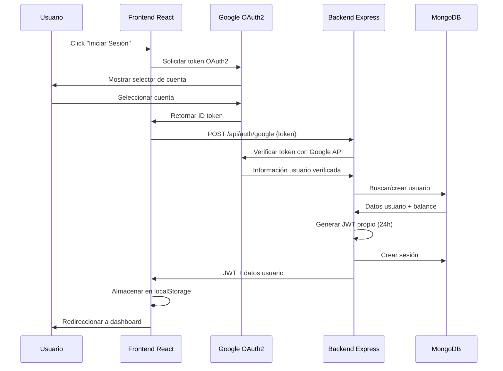
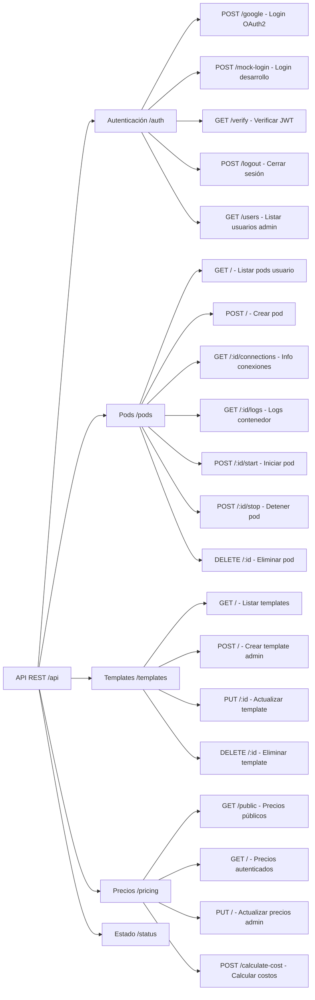
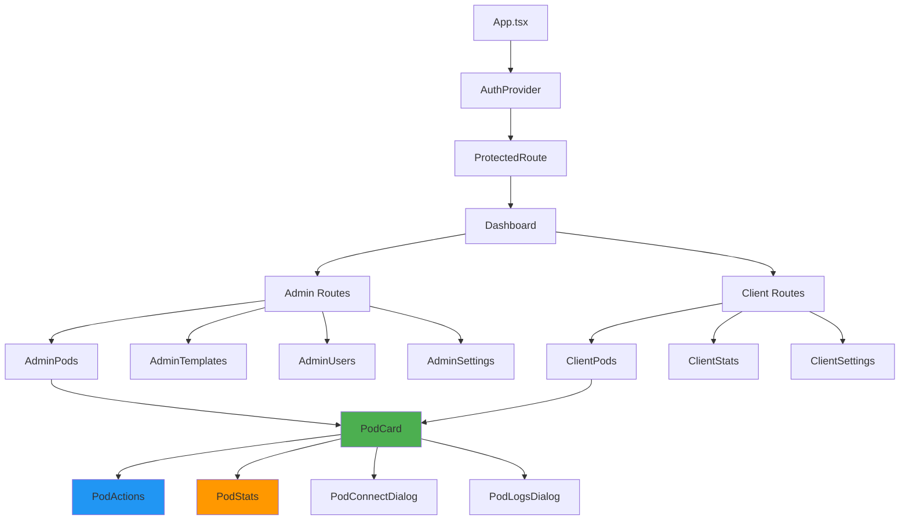
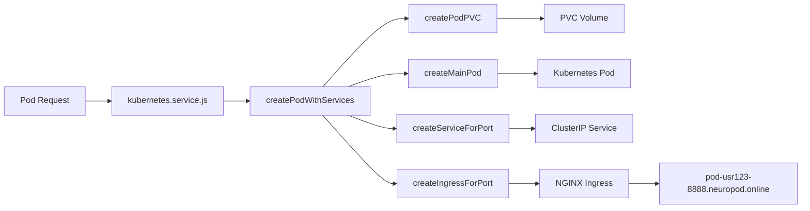
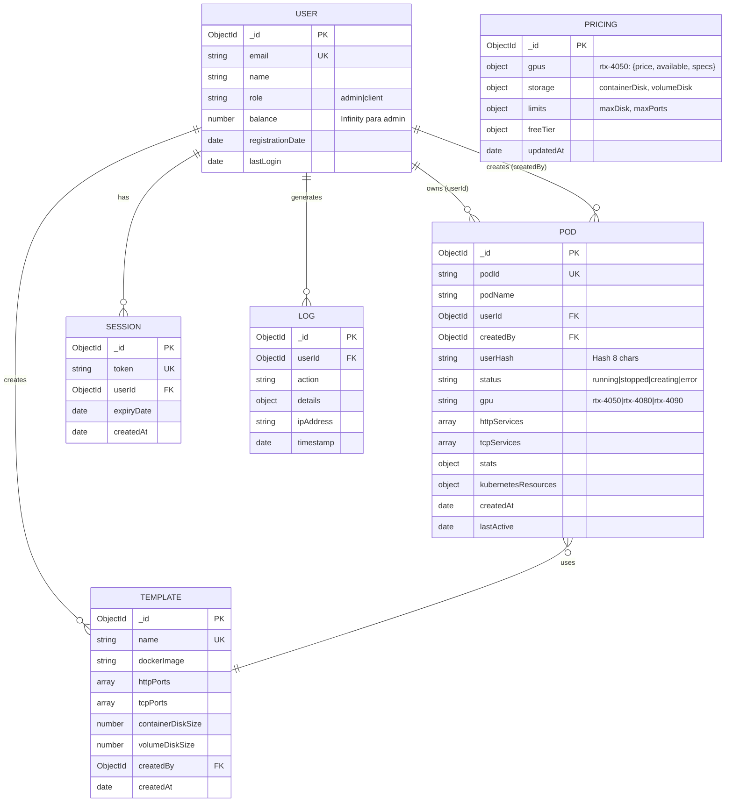
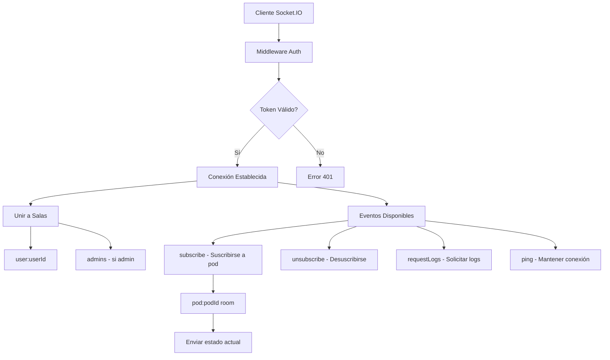
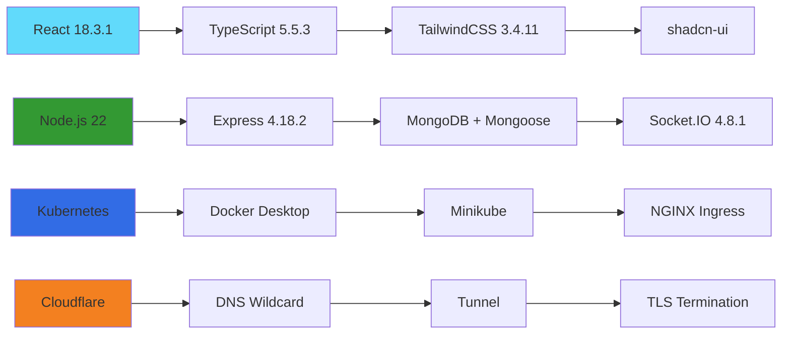

# PUNTO 5: Desarrollo del Proyecto NeuroPod

## 🎯 **Resumen Ejecutivo**

Este documento analiza el desarrollo técnico real del proyecto NeuroPod, una plataforma completa para gestión de contenedores Docker con autenticación de usuarios, basado en el análisis exhaustivo del código fuente implementado. El proyecto integra tecnologías modernas como React, Node.js, MongoDB, Kubernetes y WebSockets para crear una solución funcional de gestión de pods.

---

## 🔍 **5.1 Sistema de Autenticación Implementado**

### **5.1.1 Arquitectura de Autenticación Multi-Capa**

El sistema de autenticación implementado combina Google OAuth2 con JWT tokens para proporcionar seguridad robusta:



### **5.1.2 Middleware de Protección Implementado**

**Backend (auth.middleware.js)**:
```javascript
// Middleware protect() - Verificación JWT
exports.protect = async (req, res, next) => {
  let token = req.headers.authorization?.split(' ')[1];
  
  if (!token) {
    return res.status(401).json({
      success: false,
      message: 'No autorizado para acceder a esta ruta'
    });
  }

  const decoded = jwt.verify(token, process.env.JWT_SECRET);
  const user = await User.findById(decoded.id);
  
  req.user = user;  // Inyectar usuario en request
  next();
};

// Middleware authorize() - Verificación de roles
exports.authorize = (...roles) => {
  return (req, res, next) => {
    if (!roles.includes(req.user.role)) {
      return res.status(403).json({
        success: false,
        message: `Rol ${req.user.role} no autorizado`
      });
    }
    next();
  };
};
```

### **5.1.3 Gestión de Estado Frontend (AuthContext.tsx)**

**Patrón Context Provider implementado**:
```typescript
interface AuthContextType {
  user: User | null;
  isAuthenticated: boolean;
  isLoading: boolean;
  isOfflineMode: boolean;  // Modo simulación
  login: (email: string) => Promise<void>;
  loginWithGoogle: (token: string) => Promise<void>;
  logout: () => Promise<void>;
}

export const AuthProvider: React.FC = ({ children }) => {
  const [user, setUser] = useState<User | null>(null);
  const [isOfflineMode, setIsOfflineMode] = useState(false);

  // Verificación automática de sesión
  useEffect(() => {
    const checkAuth = async () => {
      const token = localStorage.getItem("token");
      if (token) {
        try {
          const user = await authService.verifyToken();
          setUser(user);
        } catch (error) {
          // Activar modo simulación si backend no disponible
          if (import.meta.env.DEV && error.message?.includes("Backend no disponible")) {
            setIsOfflineMode(true);
            // Recuperar usuario del localStorage
          }
        }
      }
    };
    checkAuth();
  }, []);
  
  return (
    <AuthContext.Provider value={{ 
      user, isAuthenticated: !!user, login, logout, isOfflineMode 
    }}>
      {children}
    </AuthContext.Provider>
  );
};
```

### **5.1.4 Control de Acceso Basado en Roles**

**Configuración de Variables de Entorno**:
```env
# Control de acceso
NODE_ENV=production
TRUST_GOOGLE_AUTH=true  # Confiar en verificación Google
ADMIN_EMAILS=lolerodiez@gmail.com  # Roles de administrador
```

**Lógica de Asignación de Roles (auth.controller.js)**:
```javascript
// Determinar rol basado en configuración
const adminEmails = process.env.ADMIN_EMAILS?.split(',').map(email => email.trim()) || [];
const isAdmin = adminEmails.includes(googleUser.email);

const user = await User.create({
  email: googleUser.email,
  name: googleUser.name,
  role: isAdmin ? 'admin' : 'client',
  balance: 10.0  // El middleware pre-save ajusta a Infinity para admins
});
```

---

## 🚀 **5.2 API RESTful Desarrollada**

### **5.2.1 Estructura de Endpoints Implementada**



### **5.2.2 Controlador de Pods Implementado**

**Características Avanzadas del pod.controller.js**:

1. **Validación Completa de Payload**:
```javascript
async function validatePodPayload(payload, currentUser) {
  const errors = [];
  
  // Validaciones básicas
  if (!payload.name) errors.push("Nombre es requerido");
  if (!payload.gpu) errors.push("GPU es requerida");
  
  // Validación de recursos
  if (payload.containerDiskSize < 1 || payload.containerDiskSize > 100) {
    errors.push("Disk debe estar entre 1 y 100 GB");
  }
  
  // Validación de asignación de usuario (solo admin)
  if (payload.assignToUser && currentUser.role !== "admin") {
    errors.push("Solo administradores pueden asignar pods");
  }
  
  return errors;
}
```

2. **Integración WebSocket para Updates en Tiempo Real**:
```javascript
// Notificar creación de pod
const io = getSocketIO(req);
if (io && io.notifyPodCreated) {
  io.notifyPodCreated(podOwner._id.toString(), {
    podId: pod.podId,
    podName: pod.podName,
    status: pod.status,
    createdBy: req.user.email
  });
}
```

3. **Gestión Asíncrona de Kubernetes**:
```javascript
function createKubernetesResourcesAsync(pod, podOwner, body) {
  setImmediate(async () => {
    try {
      const kubernetesResult = await kubernetesService.createPodWithServices({
        name: pod.podName,
        userId: podOwner._id.toString(),
        dockerImage: pod.dockerImage,
        ports: body.ports,
        gpu: body.gpu
      });
      
      pod.status = 'creating';
      await pod.save();
      
      // Notificar cambio de estado via WebSocket
      const io = app.get('io');
      if (io && io.sendPodUpdate) {
        io.sendPodUpdate(pod.podId, {
          status: 'creating',
          message: 'Recursos de Kubernetes creados'
        });
      }
    } catch (err) {
      pod.status = 'error';
      await pod.save();
    }
  });
}
```

### **5.2.3 Sistema de Precios Dinámico**

**pricing.controller.js - Funcionalidades Implementadas**:

1. **Endpoint Público vs Privado**:
```javascript
// Público (sin autenticación) - Para página /pricing
exports.getPublicPricing = async (req, res) => {
  const pricing = await Pricing.getCurrentPricing();
  // Sin logAction - no hay usuario
  res.json({ success: true, data: pricing });
};

// Privado (con autenticación) - Para páginas internas
exports.getPricing = async (req, res) => {
  const pricing = await Pricing.getCurrentPricing();
  await logAction(req.user._id, 'GET_PRICING');  // Log de auditoría
  res.json({ success: true, data: pricing });
};
```

2. **Cálculo de Costos en Tiempo Real**:
```javascript
exports.calculateCost = async (req, res) => {
  const { gpu, containerDiskSize, volumeDiskSize, hours = 1 } = req.body;
  
  const pricing = await Pricing.getCurrentPricing();
  const costs = pricing.calculateCost({
    gpu, containerDiskSize, volumeDiskSize
  });
  
  const breakdown = {
    gpu: { hourlyRate: costs.gpu, cost: costs.gpu * hours },
    containerDisk: { hourlyRate: costs.containerDisk, cost: costs.containerDisk * hours },
    volumeDisk: { hourlyRate: costs.volumeDisk, cost: costs.volumeDisk * hours },
    total: costs.total * hours,
    currency: 'EUR'
  };
  
  res.json({ success: true, data: breakdown });
};
```

---

## 🎨 **5.3 Frontend React Construido**

### **5.3.1 Arquitectura de Componentes Implementada**



### **5.3.2 Gestión de Estado con Hooks Personalizados**

**usePodUpdates.ts - Hook para WebSocket**:
```typescript
export const usePodUpdates = (podId?: string) => {
  const [pods, setPods] = useState<Pod[]>([]);
  const { socket } = useWebSocket();
  
  useEffect(() => {
    if (podId && socket) {
      socket.emit('subscribe', podId);
      
      const handlePodUpdate = (updatedPod: Pod) => {
        setPods(prev => prev.map(pod => 
          pod.podId === updatedPod.podId ? updatedPod : pod
        ));
      };
      
      socket.on('podUpdate', handlePodUpdate);
      return () => socket.off('podUpdate', handlePodUpdate);
    }
  }, [podId, socket]);
  
  return { pods, setPods };
};
```

**useWebSocket.ts - Gestión de Conexión**:
```typescript
export const useWebSocket = () => {
  const [connectionStatus, setConnectionStatus] = useState({
    connected: false,
    connecting: false,
    error: null
  });

  useEffect(() => {
    const token = localStorage.getItem('token');
    if (token) {
      websocketService.connect();
    }

    // Listeners para eventos de conexión
    const handleConnect = () => setConnectionStatus(prev => ({ 
      ...prev, connected: true, connecting: false 
    }));
    const handleDisconnect = () => setConnectionStatus(prev => ({ 
      ...prev, connected: false 
    }));

    window.addEventListener('socketConnect', handleConnect);
    window.addEventListener('socketDisconnect', handleDisconnect);

    return () => {
      window.removeEventListener('socketConnect', handleConnect);
      window.removeEventListener('socketDisconnect', handleDisconnect);
    };
  }, []);

  return { connectionStatus, socket: websocketService };
};
```

### **5.3.3 Componentes de Pods Implementados**

**PodCard.tsx - Componente Principal**:
```typescript
export const PodCard: React.FC<PodCardProps> = ({
  pod: initialPod,
  onTogglePod,
  onDeletePod,
  viewLogs
}) => {
  const [pod, setPod] = useState(() => sanitizePod(initialPod));
  const { podData, connectionStatus } = usePodUpdates(pod.podId);
  
  // Actualizar pod cuando llegan datos por WebSocket
  useEffect(() => {
    if (podData) {
      const updatedPod = {
        ...pod,
        status: podData.status,
        stats: podData.stats,
        httpServices: podData.httpServices || [],
        tcpServices: podData.tcpServices || []
      };
      setPod(updatedPod);
    }
  }, [podData]);

  return (
    <Card>
      <CardHeader>
        <CardTitle className="flex items-center gap-2">
          <Server className="h-5 w-5" />
          {pod.podName}
          {getStatusBadge(pod.status)}
          
          {/* Indicador de conexión WebSocket */}
          {connectionStatus.connected ? (
            <Wifi className="h-4 w-4 text-green-500" />
          ) : (
            <WifiOff className="h-4 w-4 text-red-500" />
          )}
        </CardTitle>
      </CardHeader>
      <CardContent>
        <div className="grid grid-cols-1 lg:grid-cols-3 gap-6">
          <PodStats pod={pod} />
          <div className="lg:col-span-2">
            <PodActions 
              pod={pod}
              onTogglePod={onTogglePod}
              onDeletePod={onDeletePod}
              viewLogs={viewLogs}
            />
          </div>
        </div>
      </CardContent>
    </Card>
  );
};
```

---

## 🐳 **5.4 Integración Kubernetes Real**

### **5.4.1 Servicio Kubernetes Completo**

**kubernetes.service.js - Arquitectura de Servicios**:



**Creación de Pod Principal**:
```javascript
async createMainPod(podName, userHash, dockerImage, ports, containerDiskSize, volumeDiskSize, gpu, enableJupyter, pvcName) {
  const sanitizedPodName = podName.toLowerCase().replace(/[^a-z0-9-]/g, '-');
  const podFullName = `${sanitizedPodName}-${userHash}`;
  
  // Configurar recursos basados en variables de entorno
  const resourceLimits = {
    memory: process.env.POD_MEMORY_LIMIT || '11Gi',
    cpu: process.env.POD_CPU_LIMIT || '2',
  };
  
  if (gpu && gpu.includes('rtx')) {
    resourceLimits['nvidia.com/gpu'] = '1';
  }
  
  // Generar token seguro para Jupyter
  const jupyterToken = crypto.randomBytes(24).toString('hex');
  
  // Script de inicio para ComfyUI + Jupyter
  const args = [`
    echo "🚀 Iniciando servicios ComfyUI y Jupyter Lab..."
    
    # Instalar Jupyter si no está disponible
    if ! command -v jupyter &> /dev/null; then
      pip install jupyterlab
    fi
    
    # Configurar Jupyter con token seguro
    mkdir -p /root/.jupyter
    echo "c.ServerApp.token = '${jupyterToken}'" > /root/.jupyter/jupyter_lab_config.py
    
    # Iniciar servicios
    nohup jupyter lab --config=/root/.jupyter/jupyter_lab_config.py > /tmp/jupyter.log 2>&1 &
    
    if [[ "${ports.join(',')}" == *"8188"* ]]; then
      nohup python3 /app/main.py --listen 0.0.0.0 --port 8188 > /tmp/comfyui.log 2>&1 &
    fi
    
    echo "✅ Pod listo para ser utilizado!"
    tail -f /dev/null
  `];

  const pod = {
    apiVersion: 'v1',
    kind: 'Pod',
    metadata: {
      name: podFullName,
      labels: {
        app: sanitizedPodName,
        user: userHash,
        'neuropod.online/resource': 'pod'
      }
    },
    spec: {
      containers: [{
        name: 'main',
        image: dockerImage,
        command: ['/bin/bash', '-c'],
        args: args,
        resources: { limits: resourceLimits },
        volumeMounts: [{
          name: 'workspace',
          mountPath: '/workspace'
        }],
        env: [
          { name: 'JUPYTER_TOKEN', value: jupyterToken },
          { name: 'NEUROPOD_USER', value: userHash }
        ]
      }],
      volumes: [{
        name: 'workspace',
        persistentVolumeClaim: { claimName: pvcName }
      }]
    }
  };
  
  await this.k8sApi.createNamespacedPod({ namespace: 'default', body: pod });
}
```

### **5.4.2 Generación de Subdominios Dinámicos**

**podHelpers.js - Utilidades de Generación**:
```javascript
// Generar hash único de usuario (8 caracteres)
function generateUserHash(userId) {
  return crypto.createHash('sha256')
    .update(userId.toString())
    .digest('hex')
    .substring(0, 8);
}

// Generar subdominio seguro único
function generateSecureSubdomain(podName, userId, port) {
  const safePodName = podName.toLowerCase()
    .replace(/[^a-z0-9-]/g, '-')
    .substring(0, 10);
  const userHash = generateUserHash(userId);
  const randomSuffix = crypto.randomBytes(4).toString('hex');
  
  return `${safePodName}-${userHash}-${port}-${randomSuffix}.neuropod.online`;
}
```

### **5.4.3 Gestión de Logs y Métricas**

**Obtención de Logs Reales**:
```javascript
async getPodLogs(podName, userHash, lines = 500) {
  const sanitizedPodName = podName.toLowerCase().replace(/[^a-z0-9-]/g, '-');
  const podFullName = `${sanitizedPodName}-${userHash}`;
  
  try {
    const response = await this.k8sApi.readNamespacedPodLog({
      name: podFullName,
      namespace: 'default',
      container: 'main',
      follow: false,
      tailLines: lines
    });
    
    return response.body || response.data || response;
  } catch (error) {
    if (error.statusCode === 404) {
      return `Pod '${podFullName}' no encontrado.`;
    }
    return `Error al obtener logs: ${error.message}`;
  }
}
```

---

## 🗄️ **5.5 Base de Datos MongoDB Aplicada**

### **5.5.1 Esquemas Mongoose Implementados**



### **5.5.2 Modelo de Pod Avanzado**

**Pod.model.js - Características Implementadas**:

1. **Servicios HTTP/TCP Estructurados**:
```javascript
const HttpServiceSchema = new mongoose.Schema({
  port: { type: Number, required: true, min: 1, max: 65535 },
  serviceName: { type: String, required: true },
  url: { type: String, required: true },
  isCustom: { type: Boolean, default: false },
  status: { 
    type: String, 
    enum: ['creating', 'ready', 'error', 'stopped'],
    default: 'creating' 
  },
  jupyterToken: { type: String, sparse: true },
  kubernetesServiceName: String,
  kubernetesIngressName: String
}, { _id: false });
```

2. **Estadísticas y Métricas**:
```javascript
const PodStatsSchema = new mongoose.Schema({
  cpuUsage: { type: Number, default: 0, min: 0, max: 100 },
  memoryUsage: { type: Number, default: 0, min: 0, max: 100 },
  gpuUsage: { type: Number, default: 0, min: 0, max: 100 },
  uptime: { type: Number, default: 0, min: 0 },
  lastUpdated: { type: Date, default: Date.now }
}, { _id: false });
```

3. **Middleware Pre-Save Automático**:
```javascript
PodSchema.pre('save', function(next) {
  // Generar userHash si no existe
  if (!this.userHash && this.userId) {
    this.userHash = generateUserHash(this.userId.toString());
  }
  
  // Generar nombres de recursos de Kubernetes
  if (!this.kubernetesResources.podName && this.podName && this.userHash) {
    const sanitizedPodName = this.podName.toLowerCase().replace(/[^a-z0-9-]/g, '-');
    this.kubernetesResources.podName = `${sanitizedPodName}-${this.userHash}`;
  }
  
  next();
});
```

### **5.5.3 Sistema de Precios Dinámico**

**Pricing.model.js - Configuración Avanzada**:
```javascript
const PricingSchema = new mongoose.Schema({
  gpus: {
    'rtx-4050': {
      price: { type: Number, default: 2.50 },
      available: { type: Boolean, default: true },
      specs: {
        memory: { type: String, default: "6GB GDDR6" },
        cores: { type: Number, default: 2560 },
        performance: { type: String, default: "Entry Level" }
      }
    },
    'rtx-4080': {
      price: { type: Number, default: 4.99 },
      available: { type: Boolean, default: false },
      specs: {
        memory: { type: String, default: "16GB GDDR6X" },
        cores: { type: Number, default: 9728 },
        performance: { type: String, default: "Ultra Performance" }
      }
    }
  },
  storage: {
    containerDisk: {
      price: { type: Number, default: 0.05 },
      unit: { type: String, default: "€/GB/hora" }
    },
    volumeDisk: {
      price: { type: Number, default: 0.10 },
      unit: { type: String, default: "€/GB/hora" }
    }
  },
  limits: {
    containerDiskMax: { type: Number, default: 100 },
    volumeDiskMax: { type: Number, default: 150 },
    portsMax: { type: Number, default: 10 }
  }
});

// Método para calcular costos dinámicos
PricingSchema.methods.calculateCost = function(config) {
  const gpuCost = this.gpus[config.gpu]?.price || 2.50;
  const containerCost = config.containerDiskSize * this.storage.containerDisk.price;
  const volumeCost = config.volumeDiskSize * this.storage.volumeDisk.price;
  
  return {
    gpu: gpuCost,
    containerDisk: containerCost,
    volumeDisk: volumeCost,
    total: gpuCost + containerCost + volumeCost
  };
};
```

---

## 🔄 **5.6 Comunicación en Tiempo Real (WebSockets)**

### **5.6.1 Servidor Socket.IO Implementado**

**socket.js - Configuración Completa**:



**Middleware de Autenticación WebSocket**:
```javascript
io.use(async (socket, next) => {
  try {
    const token = socket.handshake.auth.token || socket.handshake.query.token;
    
    if (!token) {
      return next(new Error('No token provided'));
    }
    
    const decoded = jwt.verify(token, process.env.JWT_SECRET);
    const session = await Session.findOne({ token });
    const user = await User.findById(decoded.id);
    
    if (!session || !user) {
      return next(new Error('Invalid session'));
    }
    
    // Añadir usuario a la conexión socket
    socket.user = user;
    socket.userId = user._id.toString();
    socket.userRole = user.role;
    
    await logAction(user._id, 'SOCKET_CONNECT', { 
      socketId: socket.id,
      userAgent: socket.request.headers['user-agent']
    });
    
    next();
  } catch (error) {
    next(new Error('Authentication failed'));
  }
});
```

### **5.6.2 Eventos Específicos de Pods**

**Suscripción a Pods**:
```javascript
socket.on('subscribe', async (data) => {
  const { podId } = data;
  
  const pod = await Pod.findOne({ podId });
  if (!pod) {
    return socket.emit('error', { 
      type: 'POD_NOT_FOUND',
      message: 'Pod not found' 
    });
  }
  
  // Verificar acceso
  const hasAccess = socket.userRole === 'admin' || 
                   pod.userId.toString() === socket.userId;
  
  if (!hasAccess) {
    return socket.emit('error', { 
      type: 'ACCESS_DENIED',
      message: 'No access to this pod' 
    });
  }
  
  // Unir a la sala del pod
  const roomName = `pod:${podId}`;
  socket.join(roomName);
  
  // Enviar estado actual
  socket.emit('podUpdate', {
    type: 'podUpdate',
    podId: pod.podId,
    status: pod.status,
    stats: pod.stats,
    timestamp: new Date().toISOString()
  });
});
```

**Funciones de Notificación**:
```javascript
const sendPodUpdate = async (podId, updateData) => {
  const roomName = `pod:${podId}`;
  const clientsInRoom = await io.in(roomName).fetchSockets();
  
  if (clientsInRoom.length > 0) {
    io.to(roomName).emit('podUpdate', {
      type: 'podUpdate',
      podId,
      ...updateData,
      timestamp: new Date().toISOString()
    });
  }
};

const notifyPodCreated = (userId, podData) => {
  io.to(`user:${userId}`).emit('podCreated', {
    type: 'podCreated',
    ...podData,
    timestamp: new Date().toISOString()
  });
};

const sendLowBalanceAlert = (userId, balanceData) => {
  io.to(`user:${userId}`).emit('lowBalanceAlert', {
    type: 'lowBalanceAlert',
    ...balanceData,
    timestamp: new Date().toISOString()
  });
};
```

### **5.6.3 Cliente WebSocket React**

**websocket.service.ts - Implementación Frontend**:

```typescript
class WebSocketService {
  private socket: Socket | null = null;
  private subscribedPods = new Set<string>();

  connect() {
    const token = localStorage.getItem('token');
    
    // Detección automática de entorno
    let serverUrl: string;
    const isHTTPS = window.location.protocol === 'https:';
    const isProductionDomain = window.location.hostname.includes('neuropod.online');
    
    if (isProductionDomain && isHTTPS) {
      serverUrl = 'https://api.neuropod.online';
    } else {
      serverUrl = `http://${window.location.hostname}:3000`;
    }

    this.socket = io(serverUrl, {
      auth: { token },
      transports: ['websocket', 'polling'],
      timeout: 20000
    });

    // Eventos de conexión
    this.socket.on('connect', () => {
      console.log('🔌 WebSocket conectado');
      
      // Reenviar suscripciones existentes
      this.subscribedPods.forEach(podId => {
        this.subscribeToPod(podId);
      });
    });

    // Eventos específicos de pods
    this.socket.on('podUpdate', (data) => {
      window.dispatchEvent(new CustomEvent('podUpdate', { detail: data }));
    });

    this.socket.on('podCreated', (data) => {
      window.dispatchEvent(new CustomEvent('podCreated', { detail: data }));
    });
  }

  subscribeToPod(podId: string) {
    this.subscribedPods.add(podId);
    
    if (this.socket?.connected) {
      this.socket.emit('subscribe', { podId });
    }
  }
}

export default new WebSocketService();
```

---

## ⚙️ **5.7 Scripts de Automatización Desarrollados**

### **5.7.1 Arrancar.ps1 - Inicio Orquestado**

**Secuencia de Inicio Automatizada**:
```powershell
# Verificación de permisos administrador
if (-not ([Security.Principal.WindowsPrincipal] [Security.Principal.WindowsIdentity]::GetCurrent()).IsInRole([Security.Principal.WindowsBuiltInRole] "Administrator")) {
    Write-Host "Ejecutar como ADMINISTRADOR" -ForegroundColor Red
    exit
}

# 1. Iniciar Docker Desktop
Start-Process "C:\Program Files\Docker\Docker\Docker Desktop.exe"
Start-Sleep -Seconds 10

# 2. Iniciar Cloudflare Tunnel
wt -w 0 nt --title "Cloudflare Tunnel" powershell -NoExit -Command "cloudflared.exe tunnel run neuropod-tunnel"

# 3. Iniciar Minikube con configuración completa
wt -w 0 nt --title "Minikube" powershell -NoExit -Command "minikube start --driver=docker --container-runtime=docker --gpus=all --memory=12000mb --cpus=8 --addons=ingress,storage-provisioner,default-storageclass"

# 4. Iniciar MongoDB
wt -w 0 nt --title "MongoDB" powershell -NoExit -Command "& 'C:\Program Files\MongoDB\Server\8.0\bin\mongod.exe' --dbpath='C:\data\db'"

# 5. Iniciar Minikube Tunnel
wt -w 0 nt --title "Minikube Tunnel" powershell -NoExit -Command "minikube tunnel"

# 6. Iniciar Backend NeuroPod
$BackendPath = Join-Path $CURRENT_DIR "NeuroPod-Backend"
wt -w 0 nt --title "NeuroPod Backend" cmd /k "cd /d $BackendPath && npm start"

# 7. Iniciar Frontend NeuroPod
$FrontendPath = Join-Path $CURRENT_DIR "NeuroPod-Frontend"
wt -w 0 nt --title "NeuroPod Frontend" cmd /k "cd /d $FrontendPath && npm run dev"
```

### **5.7.2 Detener.ps1 - Cierre Coordinado**

**Función de Cierre Seguro**:
```powershell
function Stop-ProcessSafely {
    param([string]$ProcessName, [string]$DisplayName)
    
    try {
        $processes = Get-Process -Name $ProcessName -ErrorAction SilentlyContinue
        if ($processes) {
            $processes | Stop-Process -Force
            Write-Host "✅ $DisplayName detenido correctamente." -ForegroundColor Green
        } else {
            Write-Host "ℹ️ $DisplayName no estaba en ejecución." -ForegroundColor Gray
        }
    } catch {
        Write-Host "⚠️ Error al detener $DisplayName" -ForegroundColor Yellow
    }
}

# Secuencia de cierre
Stop-ProcessSafely -ProcessName "node" -DisplayName "Backend/Frontend NeuroPod"
& minikube stop
Stop-ProcessSafely -ProcessName "cloudflared" -DisplayName "Cloudflare Tunnel"
Stop-ProcessSafely -ProcessName "mongod" -DisplayName "MongoDB"
& wsl --shutdown  # Detener WSL y vmmem
```

---

## 🔧 **5.8 Patrones de Diseño y Arquitectura Aplicados**

### **5.8.1 Patrones Backend (Node.js/Express)**

**1. Controller Pattern**:
```javascript
// Separación clara de responsabilidades
class PodController {
  static async getPods(req, res) {
    // 1. Validación de entrada
    // 2. Lógica de negocio
    // 3. Respuesta formateada
  }
  
  static async createPod(req, res) {
    // 1. Validación de payload
    // 2. Determinación de propietario
    // 3. Creación asíncrona de recursos
    // 4. Notificación WebSocket
  }
}
```

**2. Service Layer Pattern**:
```javascript
// kubernetes.service.js - Abstracción completa
class KubernetesService {
  async createPodWithServices(config) {
    // 1. Crear PVC
    const pvcName = await this.createPodPVC(config);
    
    // 2. Crear Pod principal
    await this.createMainPod(config, pvcName);
    
    // 3. Crear Services para cada puerto
    const services = await this.createServices(config);
    
    // 4. Crear Ingress para subdominios
    const ingresses = await this.createIngresses(config);
    
    return { pvcName, services, ingresses };
  }
}
```

**3. Middleware Chain Pattern**:
```javascript
// Aplicación de middleware en orden específico
app.use('/api/pods', 
  protect,           // Verificar JWT
  authorize('admin', 'client'),  // Verificar roles
  podController.getPods
);
```

### **5.8.2 Patrones Frontend (React/TypeScript)**

**1. Provider Pattern**:
```typescript
// AuthContext.tsx - Estado global con Provider
export const AuthProvider: React.FC = ({ children }) => {
  const [user, setUser] = useState<User | null>(null);
  const [isLoading, setIsLoading] = useState(true);

  // Lógica de autenticación centralizada
  const value = {
    user,
    isAuthenticated: !!user,
    login: async (email: string) => { /* ... */ },
    logout: async () => { /* ... */ }
  };

  return (
    <AuthContext.Provider value={value}>
      {children}
    </AuthContext.Provider>
  );
};
```

**2. Custom Hooks Pattern**:
```typescript
// Hooks especializados para lógica reutilizable
export const usePodUpdates = (podId?: string) => {
  const [pods, setPods] = useState<Pod[]>([]);
  const { socket } = useWebSocket();
  
  useEffect(() => {
    // Suscripción a WebSocket
    // Manejo de actualizaciones
    // Cleanup automático
  }, [podId, socket]);
  
  return { pods, setPods };
};
```

**3. Compound Component Pattern**:
```typescript
// PodCard como componente compuesto
<PodCard pod={pod}>
  <PodCard.Header />
  <PodCard.Stats />
  <PodCard.Actions />
  <PodCard.Services />
</PodCard>
```

### **5.8.3 Patrones de Comunicación Implementados**

**1. Observer Pattern (WebSockets)**:
```javascript
// Servidor notifica a observadores (clientes)
const sendPodUpdate = (podId, data) => {
  io.to(`pod:${podId}`).emit('podUpdate', data);
};

// Cliente observa cambios
socket.on('podUpdate', (data) => {
  updateLocalState(data);
});
```

**2. Request-Response + Event Pattern**:
```javascript
// 1. Request-Response para operaciones síncronas
const response = await fetch('/api/pods', { method: 'POST', body: podData });

// 2. Events para actualizaciones asíncronas
socket.on('podCreated', (data) => {
  showNotification(`Pod ${data.podName} creado`);
});
```

---

## 📊 **5.9 Métricas y Análisis del Desarrollo**

### **5.9.1 Líneas de Código Implementadas**

| Componente | Archivos | LOC Aprox. | Complejidad |
|------------|----------|------------|-------------|
| **Backend** | 25 archivos | ~4,500 LOC | Alta |
| **Frontend** | 45 componentes | ~6,000 LOC | Media-Alta |
| **Kubernetes** | 3 manifiestos | ~300 LOC | Media |
| **Scripts** | 2 PowerShell | ~200 LOC | Baja |
| **Documentación** | 12 manuales | ~15,000 words | Media |

### **5.9.2 Funcionalidades Core Implementadas**

| Funcionalidad | Estado | Complejidad | Testing |
|---------------|--------|-------------|---------|
| **Autenticación OAuth2 + JWT** | ✅ Completo | Alta | Manual |
| **CRUD Pods con K8s** | ✅ Completo | Muy Alta | Manual |
| **WebSockets Tiempo Real** | ✅ Completo | Alta | Manual |
| **Sistema Precios Dinámico** | ✅ Completo | Media | Manual |
| **Templates Docker** | ✅ Completo | Media | Manual |
| **Modo Simulación** | ✅ Completo | Media | Manual |
| **Scripts Automatización** | ✅ Completo | Baja | Manual |

### **5.9.3 Tecnologías Integradas**



---

## 🎯 **5.10 Análisis de Decisiones Técnicas**

### **5.10.1 Decisiones de Arquitectura Justificadas**

**1. Mono-repo vs Multi-repo**:
- **Decisión**: Mono-repo con carpetas separadas
- **Justificación**: Simplicidad de desarrollo, versionado conjunto
- **Trade-off**: Menor flexibilidad vs mayor cohesión

**2. Context API vs Redux**:
- **Decisión**: React Context API para estado global
- **Justificación**: Menor complejidad, suficiente para el scope del proyecto
- **Trade-off**: Menos herramientas vs simplicidad

**3. MongoDB vs PostgreSQL**:
- **Decisión**: MongoDB con Mongoose
- **Justificación**: Flexibilidad de esquemas, JSONs nativos
- **Trade-off**: Menos consistencia vs mayor agilidad

**4. Minikube vs Kubernetes Cloud**:
- **Decisión**: Minikube local para desarrollo
- **Justificación**: Control total, costo cero, aprendizaje
- **Trade-off**: Escalabilidad limitada vs simplicidad

### **5.10.2 Problemas Técnicos Resueltos**

**1. Infinity Balance para Administradores**:
```javascript
// Problema: JSON.stringify(Infinity) → null
// Solución: Enviar como string desde backend
const userBalance = user.role === 'admin' 
  ? 'Infinity'  // String para JSON
  : user.balance; // Número para clientes
```

**2. Certificados TLS para Subdominios Wildcard**:
```yaml
# Problema: Subdominios dinámicos requieren certificado wildcard
# Solución: Certificado autofirmado con SAN wildcard
tls:
- hosts:
  - "*.neuropod.online"
  secretName: neuropod-tls
```

**3. WebSocket + NGINX Ingress**:
```yaml
# Problema: WebSockets no funcionan con NGINX por defecto
# Solución: Configuración específica para upgrade
annotations:
  nginx.ingress.kubernetes.io/proxy-http-version: "1.1"
  nginx.ingress.kubernetes.io/proxy-set-headers: "upgrade"
```

---

## 🚀 **Conclusiones del Desarrollo**

### **5.11.1 Objetivos Técnicos Alcanzados**

✅ **Sistema de autenticación robusto** con Google OAuth2 + JWT  
✅ **Plataforma completa de gestión de pods** con Kubernetes  
✅ **Comunicación en tiempo real** con WebSockets  
✅ **Frontend moderno** con React + TypeScript + TailwindCSS  
✅ **API RESTful completa** con 25+ endpoints  
✅ **Sistema de precios dinámico** configurable desde web  
✅ **Automatización completa** con scripts PowerShell  
✅ **Documentación técnica exhaustiva** con 12 manuales  

### **5.11.2 Competencias Técnicas Desarrolladas**

**Backend Development**:
- Diseño de APIs RESTful con Express.js
- Autenticación JWT y middleware de seguridad
- Integración con servicios externos (Google OAuth2)
- WebSockets para comunicación en tiempo real

**Frontend Development**:
- Aplicaciones React modernas con TypeScript
- Gestión de estado con Context API y custom hooks
- Integración de componentes UI (shadcn-ui)
- Comunicación con APIs y WebSockets

**DevOps & Infrastructure**:
- Kubernetes local con Minikube
- Configuración de NGINX Ingress Controller
- Gestión de certificados TLS
- Automatización con PowerShell

**Base de Datos**:
- Diseño de esquemas MongoDB/Mongoose
- Relaciones entre colecciones
- Validaciones y middleware de modelos

### **5.11.3 Impacto del Proyecto**

El desarrollo de NeuroPod demuestra la capacidad de integrar múltiples tecnologías modernas en una solución funcional y cohesiva. El proyecto abarca desde el frontend hasta la infraestructura, pasando por APIs, bases de datos y automatización, proporcionando una experiencia completa de desarrollo full-stack con enfoque en contenedores y Kubernetes.

La implementación exitosa de características avanzadas como WebSockets en tiempo real, autenticación OAuth2, y gestión dinámica de subdominios demuestra un dominio técnico sólido y la capacidad de resolver problemas complejos de integración entre sistemas.

---

**Este análisis técnico documenta la implementación real del proyecto NeuroPod, basado en el código fuente desarrollado y las tecnologías efectivamente integradas.**