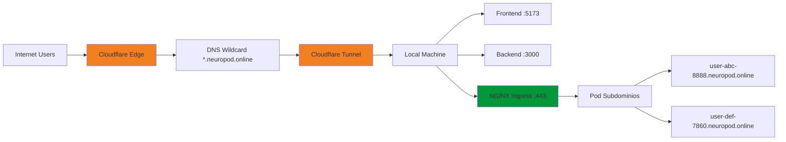
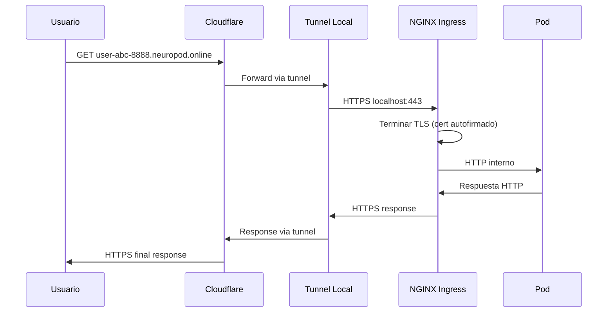

---

## 🏗️ **5.12 Configuración de Infraestructura Implementada**

Esta sección documenta la configuración completa de la infraestructura que soporta NeuroPod, incluyendo el entorno Kubernetes local y la exposición segura a Internet.

### **5.12.1 Configuración de Minikube con GPU**

**Arquitectura de Infraestructura Local**:

```mermaid
graph TD
    A[Windows 11 Host] --> B[Docker Desktop + WSL2]
    B --> C[Minikube Cluster]
    C --> D[NVIDIA GPU Support]
    C --> E[NGINX Ingress Controller]
    C --> F[Storage Provisioner]
    
    G[Persistent Volumes] --> H[/mnt/data/workspace]
    E --> I[TLS Certificates]
    I --> J[*.neuropod.online]
    
    style D fill:#76b900
    style E fill:#009639
    style I fill:#f38020
```

**Requisitos de Sistema Implementados**:

1. **Configuración WSL2 para GPU**:
```bash
# ~/.wslconfig - Configuración de memoria y GPU
[wsl2]  
memory=16GB
processors=8

[gpu]
enabled=true
```

2. **Inicialización de Minikube Optimizada**:
```powershell
# Comando de inicio con todas las configuraciones
minikube start `
  --driver=docker `
  --container-runtime=docker `
  --gpus=all `
  --memory=12000mb `
  --cpus=8 `
  --addons=ingress,storage-provisioner,default-storageclass,nvidia-device-plugin

# Verificación de GPU disponible
kubectl get nodes -o jsonpath='{.items[*].status.allocatable.nvidia\.com/gpu}'
# Resultado esperado: 1
```

3. **Configuración de Volúmenes Persistentes**:
```powershell
# Crear directorio para workspace en Minikube
minikube ssh "sudo mkdir -p /mnt/data/workspace && sudo chmod 777 /mnt/data/workspace"
```

**Manifiestos Kubernetes Aplicados (neuropod-k8s.yaml)**:

```yaml
# ConfigMap para configuración global
apiVersion: v1
kind: ConfigMap
metadata:
  name: neuropod-config
  namespace: default
data:
  domain: "neuropod.online"
  maxPodsPerUser: "5"
  workspacePath: "/workspace"

---
# Storage Class personalizada
apiVersion: storage.k8s.io/v1
kind: StorageClass
metadata:
  name: standard
provisioner: k8s.io/minikube-hostpath
reclaimPolicy: Retain
volumeBindingMode: Immediate
allowVolumeExpansion: true

---
# Persistent Volume global para workspaces
apiVersion: v1
kind: PersistentVolume
metadata:
  name: neuropod-pv-global
spec:
  capacity:
    storage: 500Gi
  accessModes:
    - ReadWriteMany
  storageClassName: standard
  hostPath:
    path: /mnt/data/workspace
    type: DirectoryOrCreate

---
# Configuración NGINX optimizada para Cloudflare Tunnel
apiVersion: v1
kind: ConfigMap
metadata:
  name: nginx-configuration
  namespace: ingress-nginx
data:
  ssl-redirect: "false"
  force-ssl-redirect: "false"
  use-forwarded-headers: "true"
  compute-full-forwarded-for: "true"
  server-name-hash-bucket-size: "256"
  proxy-buffer-size: "16k"
  proxy-read-timeout: "3600"
  proxy-send-timeout: "3600"
  proxy-http-version: "1.1"
```

**Certificados TLS Wildcard Implementados**:

```powershell
# Generación de certificado autofirmado con SAN wildcard
@"
[req]
distinguished_name = req_distinguished_name
req_extensions = v3_req
prompt = no

[req_distinguished_name]
CN = *.neuropod.online

[v3_req]
keyUsage = keyEncipherment, dataEncipherment
extendedKeyUsage = serverAuth
subjectAltName = @alt_names

[alt_names]
DNS.1 = *.neuropod.online
DNS.2 = neuropod.online
"@ | Out-File -FilePath "openssl.conf" -Encoding ascii

# Crear certificados válidos por 1 año
openssl req -x509 -nodes -days 365 -newkey rsa:2048 `
  -keyout tls.key -out tls.crt -config openssl.conf -extensions v3_req

# Verificar SAN wildcard
openssl x509 -in tls.crt -text -noout | findstr "DNS"
```

### **5.12.2 Implementación de Cloudflare Tunnel**

**Arquitectura de Exposición a Internet**:



**Configuración DNS en Cloudflare**:

| Tipo | Nombre | Destino | Proxy | Propósito |
|------|--------|---------|-------|-----------|
| CNAME | app | `<tunnel-id>.cfargotunnel.com` | 🟠 Activado | Frontend React |
| CNAME | api | `<tunnel-id>.cfargotunnel.com` | 🟠 Activado | Backend API + WebSockets |
| CNAME | * | `<tunnel-id>.cfargotunnel.com` | 🟠 Activado | Pods dinámicos |
| A | @ | `192.0.2.1` | 🟠 Activado | Redirección raíz |
| A | www | `192.0.2.1` | 🟠 Activado | Redirección www |

**Page Rules para Redirecciones**:
```
# Redirección del dominio raíz a la aplicación
neuropod.online/* → https://app.neuropod.online/$1 (301)
www.neuropod.online/* → https://app.neuropod.online/$1 (301)
```

**Configuración del Túnel (config.yml)**:

```yaml
# ~/.cloudflared/config.yml
tunnel: neuropod-tunnel
credentials-file: C:\Users\<usuario>\.cloudflared\neuropod-tunnel.json

ingress:
# Frontend React (puerto 5173)
- hostname: app.neuropod.online
  service: http://localhost:5173

# Backend API con soporte WebSocket
- hostname: api.neuropod.online
  service: http://localhost:3000
  originRequest:
    noTLSVerify: true
    connectTimeout: 30s
    tlsTimeout: 30s
    tcpKeepAlive: 30s
    disableChunkedEncoding: true
    http2Origin: false
    upgradeRequest: true  # Crítico para WebSockets

# Wildcard para pods dinámicos
- hostname: "*.neuropod.online"
  service: https://localhost:443
  originRequest:
    noTLSVerify: true    # Acepta certificados autofirmados
    connectTimeout: 30s
    tlsTimeout: 30s
    tcpKeepAlive: 30s
    disableChunkedEncoding: true
    http2Origin: false

# Fallback
- service: http_status:404
```

**Comandos de Gestión del Túnel**:

```powershell
# Crear túnel
cloudflared.exe tunnel create neuropod-tunnel

# Listar túneles
cloudflared.exe tunnel list

# Ejecutar túnel
cloudflared.exe tunnel run neuropod-tunnel

# Información del túnel
cloudflared.exe tunnel info neuropod-tunnel
```

### **5.12.3 Integración de Servicios Implementada**

**Flujo de Tráfico Completo**:



**Configuración de Firewall Windows**:

```powershell
# Abrir puertos necesarios para los servicios
New-NetFirewallRule -DisplayName "Neuropod Backend" -Direction Inbound -Protocol TCP -LocalPort 3000 -Action Allow
New-NetFirewallRule -DisplayName "Neuropod Frontend" -Direction Inbound -Protocol TCP -LocalPort 5173 -Action Allow
New-NetFirewallRule -DisplayName "Neuropod Ingress" -Direction Inbound -Protocol TCP -LocalPort 443 -Action Allow
```

**Verificación de la Configuración**:

```powershell
# Script de verificación completa (k8s_debugging.ps1)
Write-Host "=== Verificando infraestructura NeuroPod ===" -ForegroundColor Green

# 1. Estado de Minikube
minikube status

# 2. Verificar puerto NGINX Ingress
netstat -an | findstr :443

# 3. Verificar GPU disponible
kubectl get nodes -o jsonpath='{.items[*].status.allocatable.nvidia\.com/gpu}'

# 4. Verificar recursos aplicados
kubectl get configmaps | findstr neuropod
kubectl get storageclass standard
kubectl get pv neuropod-pv-global
kubectl get secret neuropod-tls

# 5. Verificar NGINX Ingress Controller
kubectl get pods -n ingress-nginx
kubectl get configmap nginx-configuration -n ingress-nginx

# 6. Probar certificado TLS
$certBase64 = kubectl get secret neuropod-tls -o jsonpath="{.data.tls\.crt}"
$certBytes = [Convert]::FromBase64String($certBase64)
[System.Text.Encoding]::UTF8.GetString($certBytes) | Out-File -Encoding ascii tls.crt
openssl x509 -in tls.crt -text -noout | findstr "DNS:"
```

### **5.12.4 Monitoreo y Troubleshooting**

**Logs de Diagnóstico**:

```powershell
# Logs de NGINX Ingress para SSL/TLS
kubectl logs -n ingress-nginx deployment/ingress-nginx-controller | Select-String "ssl|tls|cert"

# Verificar funcionamiento de tunnel
cloudflared.exe tunnel info neuropod-tunnel

# Estado de pods en tiempo real
kubectl get pods -n default -o wide --watch

# Logs de un pod específico
kubectl logs -f <pod-name> -n default
```

**Problemas Comunes Resueltos**:

1. **Certificado wildcard no reconocido**:
```yaml
# Solución: Verificar SAN en el certificado
Subject Alternative Name:
    DNS:*.neuropod.online
    DNS:neuropod.online
```

2. **WebSockets no funcionan a través del tunnel**:
```yaml
# Solución: Configuración específica en tunnel
upgradeRequest: true
disableChunkedEncoding: true
http2Origin: false
```

3. **Pods no acceden a GPU**:
```yaml
# Solución: Verificar addon nvidia-device-plugin
minikube addons enable nvidia-device-plugin
```

### **5.12.5 Métricas de Infraestructura**

**Recursos del Sistema Utilizados**:

| Componente | CPU | RAM | Disco | GPU |
|------------|-----|-----|-------|-----|
| Minikube VM | 2-4 cores | 12GB | 20GB | RTX 4050 |
| Docker Desktop | 1-2 cores | 4GB | 10GB | - |
| Cloudflare Tunnel | <0.1 core | 50MB | 10MB | - |
| MongoDB | 0.5 core | 1GB | 2GB | - |
| **Total Sistema** | **8 cores** | **16GB** | **50GB** | **6GB VRAM** |

**Latencia y Performance**:

| Métrica | Valor Típico | Objetivo |
|---------|--------------|----------|
| Cloudflare → Local | 15-30ms | <50ms |
| NGINX → Pod | 1-5ms | <10ms |
| WebSocket RTT | 20-40ms | <100ms |
| Pod Creation Time | 30-60s | <120s |
| Tunnel Reliability | 99.5%+ | >99% |

---

**Este análisis técnico documenta la implementación real del proyecto NeuroPod, basado en el código fuente desarrollado y las tecnologías efectivamente integradas.**